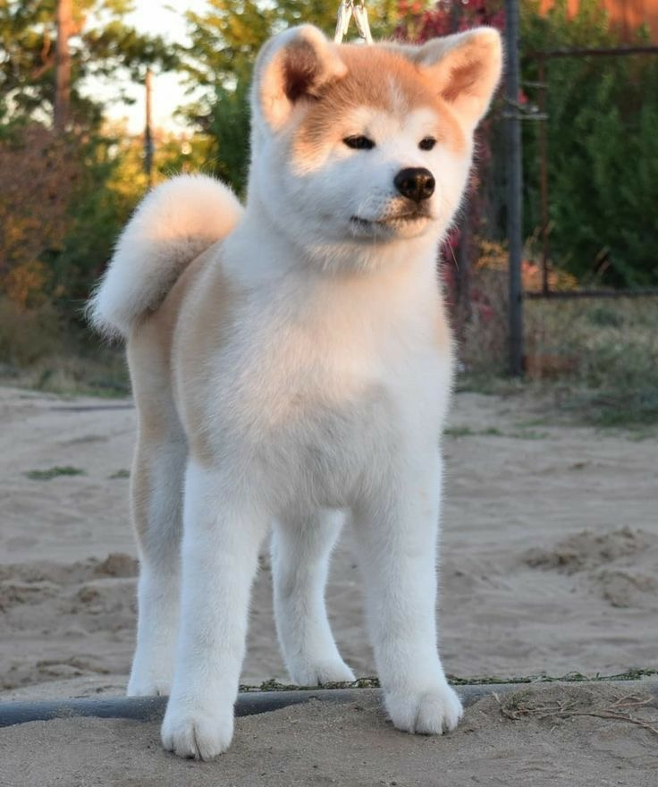
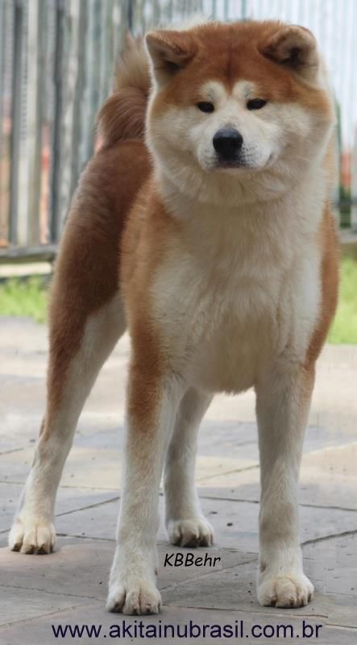
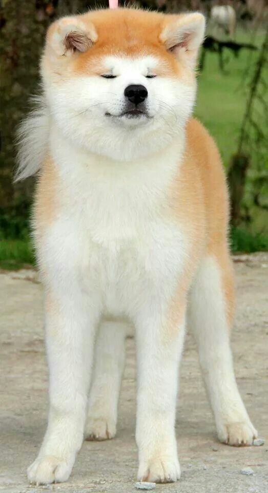
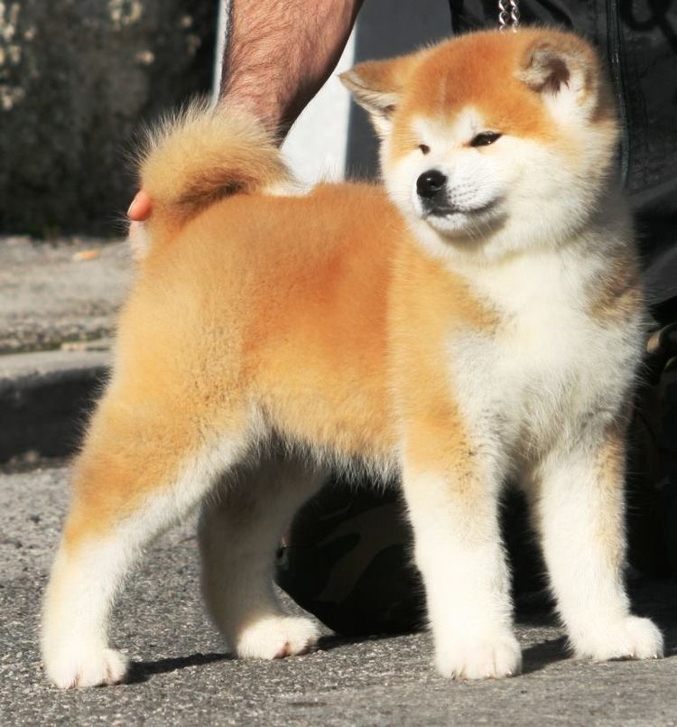
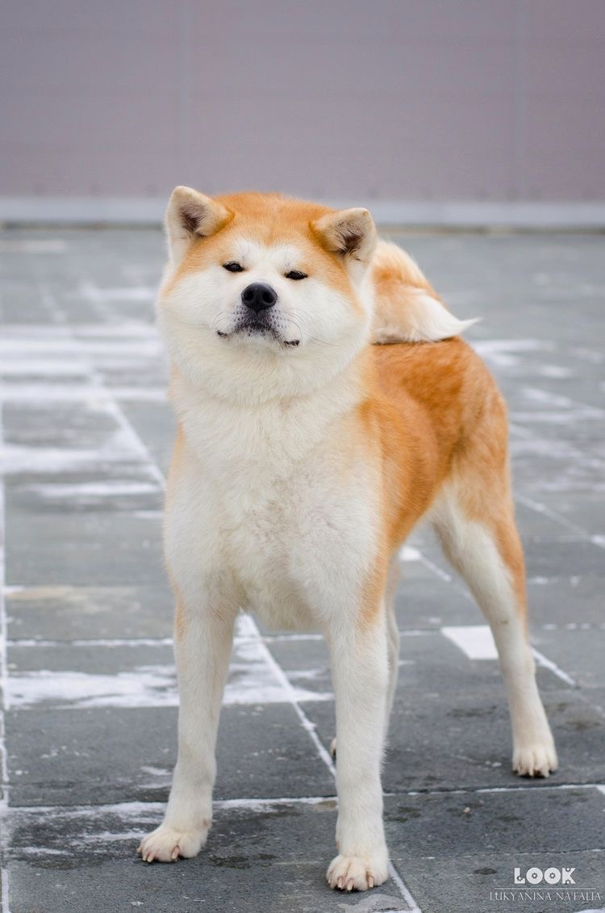
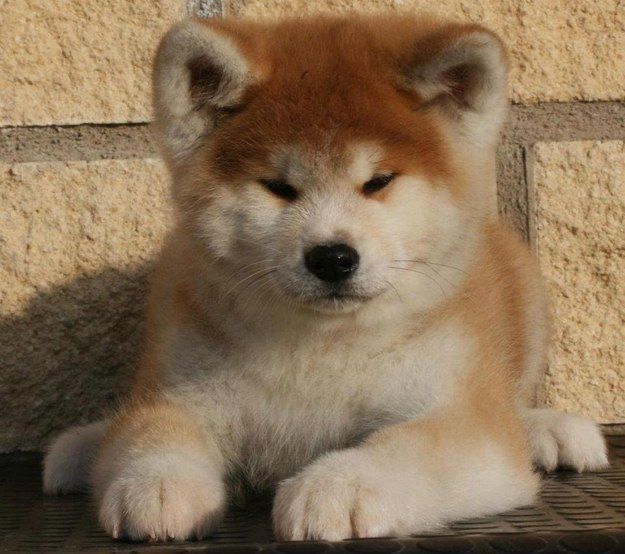
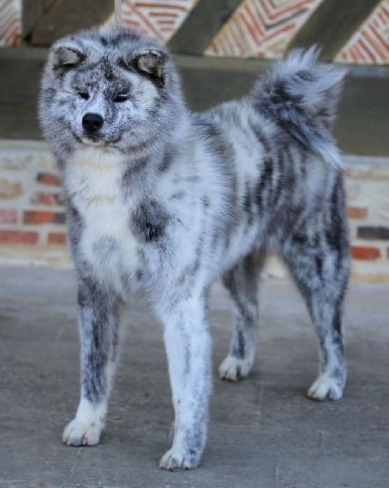
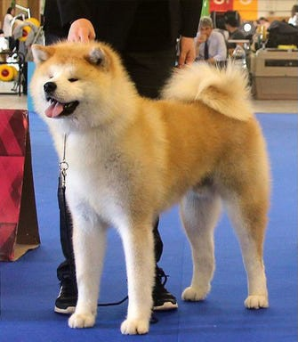
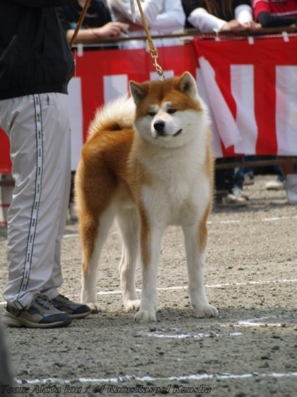
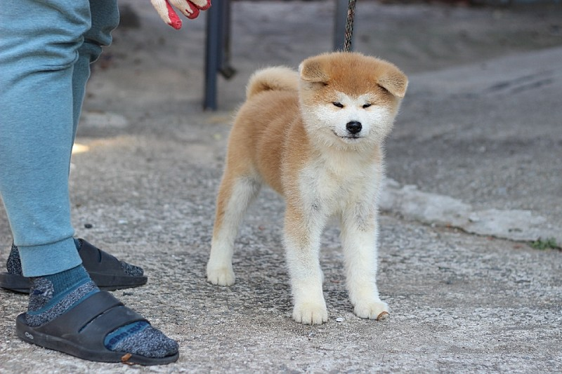

## 아키타견이란?

아키타견은 일본의 대표적인 견종 중 하나로써, 일본 아키타현 지방의 개의 품종입니다. 의외로 역사는 짧은편에 속하는 견종으로 16세기 *아키타 마타기*라고 불리는 사냥을 위해 길러진 토착견이 기원입니다.

## 아키타견의 특징

아키타견은 ‘秋田犬’라고 쓰고 ‘아키타이누’라고 읽습니다. 다리가 길고 골격이 튼실한 대형견으로 분류됩니다.
털은 이중구조로 되어 있어 아키타의 혹한에도 강하고 삼각형 귀는 시바견보다 두께가 있습니다.
민첩하며 근육이 발달했다. 또한 보기보다는 달리 아주 덩치가 큽니다! [^1] 머리는 삼각형이고 이목구비가 몰려있는데요, 애호가들은 흔히 '여우얼굴' 같다는 표현을 쓴다고 합니다.

[^1]: 키 60~71cm에 무게 32~50kg 정도.

## 아키타견의 성격

두려움이 없고 사냥에 능숙하며, 주인에 대한 충성심이 강합니다. 애교가 없고 노는 것을 좋아하지 않는 특성이 있다고 하네요.... 😂
또한 홀로 있는 것을 좋아하며, 가족이 아닌 다른 개에 공격적일 수 있습니다. 적절하게 사회화되면 잘 지내겠지만 여전히 우두머리가 될려고 한다네요..

큰 덩치 때문에 관리하기가 어려울 수 있으므로 편하게 키울 수 있는 개는 아니라고 해요. 힘과 인내력이 가졌으므로 철저한 훈련을 통해 에너지를 적절히 분출하도록 가르쳐야 한다고 하네요. 지능이 높은 종이긴 하지만 아키타견은 매우 쉽게 훈련에 질립니다. 어려운 과제를 주고 할 일을 줄 때는 매우 열정적으로 수행한다고 하네요. 😂

## 대중문화 속 아키타견

영화 하치 이야기 (2009) 에서 나왔던 그 주인공이라고 하네요!

그럼 더 아키타견의 매력에 빠져보실까요?

## 출처 및 참고

- [충견 아키타견의 고향, 오다테](https://stayakita.com/ko/akita-stories/akita-dog-ko)
- [아키타견에 90% 사람들이 모르는 흥미로운 사실들 - 꽁냥백과](https://tnswns88888.tistory.com/153)
- [아키타견](https://namu.wiki/w/%EC%95%84%ED%82%A4%ED%83%80%EA%B2%AC)
- [아키타견 견종 정보와 성격 특성](https://www.hillspet.co.kr/dog-care/dog-breeds/akita)
