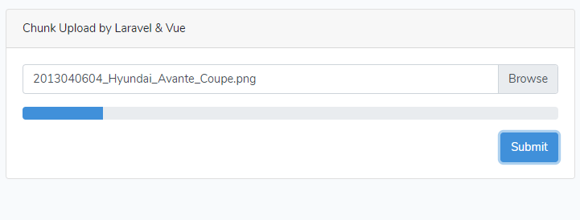

## 들어가며

파일 업로드 구현이야 많이들 해보셨겠지만
용량이 커진다면? 생각보다 신경쓸게 많아집니다.


분할 업로드를 구현했을 때 얻을 수 있는 이점들은 생각보다 꽤 많습니다. 가령...<br />

- 낮은 서버 대기 시간
- 느린 클라이언트에게도 축복을
- 또한 멋진 업로드 매니저도 구현이 가능하구요

오늘은 [axios](https://github.com/axios/axios) 라이브러리를 활용하여<br />
[resumablejs](https://github.com/23/resumable.js) 라이브러리 메뉴얼을 참고하여 분할 업로드 기능을 구현해보도록 하겠습니다.

## 원리

원리는 정말 간단합니다. 파일을 그냥 짤라서 서버에 던지고, 서버에서는 파일을 합치면 됩니다.


물론 말은 쉽겠지만 코드로 이야기 하겠습니다.

### 백엔드

먼저 이 글의 중점은 프론트엔드이므로, 기존 라이브러리를 활용하도록 하겠습니다.
빠른 진행을 위해서 laravel 을 선택 했습니다.

```shell
composer create-project --prefer-dist laravel/laravel
```

이 라이브러리가 쓸만한거 같더군요.

```shell
composer require pion/laravel-chunk-upload
```

이제 업로드를 처리할 Controller 를 정의합니다.
업로드 진행시 퍼센트를 리턴해주며, 완료시에는 파일 병합 및 이동을 담당하게 됩니다.

```php
class UploadController extends Controller
{
    //
    public function request(Request $request, FileReceiver $receiver)
    {
        if ($receiver->isUploaded() === false) {
            throw new UploadMissingFileException();
        }

        // receive the file
        $save = $receiver->receive();

        // check if the upload has finished (in chunk mode it will send smaller files)
        if ($save->isFinished()) {
            // save the file and return any response you need
            return $this->saveFile($save->getFile());
        }

        $handler = $save->handler();

        return response()->json([
            "done" => $handler->getPercentageDone(),
            "status" => true
        ]);
    }

    /**
     * Saves the file
     *
     * @param UploadedFile $file
     *
     * @return \Illuminate\Http\JsonResponse
     */
    protected function saveFile(UploadedFile $file)
    {
        $fileName = $this->createFilename($file);

        // Group files by the date
        $yearFolder = date('Y');
        $monthFolder = date('m');
        $filePath = "upload/{$yearFolder}/{$monthFolder}/";
        $finalPath = storage_path("app/public/{$filePath}");

        // move the file name
        $file->move($finalPath, $fileName);

        return [
            'path' => Storage::url($filePath . $fileName)
        ];
    }

    /**
     * Create unique filename for uploaded file
     * @param UploadedFile $file
     * @return string
     */
    protected function createFilename(UploadedFile $file)
    {
        return implode([
            time(),
            mt_rand(100, 999),
            '.',
            $file->getClientOriginalExtension()
        ]);
    }
}
```

## 프론트엔드

라라벨이 기본셋으로 vue 를 지원하여 선택하였습니다. (물론 react 도 지원합니다.)<br />
별다른 설정 없이도 hot reload + webpack 을 지원하여 대!단!히! 편합니다.


input 태그를 담는 vue component 를 만들어 봅시다.

```html
<input
  type="file"
  class="custom-file-input"
  accept="video/*,audio/*,image/*"
  ref="fileContainer"
  @change="onChangeFile"
/>
```

파일을 첨부하면, data 에 자동으로 등록되게끔 했습니다.

```javascript
	onChangeFile() {
		const file = this.$refs.fileContainer.files;
		this.file = file.length > 0 ? file[0] : null;
	}
```

onsubmit 이벤트 시점에 axios 로 POST 호출하도록 설정하겠습니다.

```javascript
const api = axios.create({
  headers: {
    'Content-type': 'application/x-www-form-urlencoded',
    Accept: 'application/json',
  },
});

const chunkSize = 1024 * 1024;
```

axios 개체를 만들어주고, 한번에 1Mb 씩 업로드하도록 사이즈를 지정했습니다.

```javascript
const start = options.chunkNumber * chunkSize;
const end = Math.min(file.size, start + chunkSize);

let currentChunkSize = chunkSize;
if (options.chunkNumber + 1 === options.blockCount) {
  currentChunkSize = file.size - start;
}

const params = new FormData();
params.append('resumableChunkNumber', options.chunkNumber + 1);
params.append('resumableChunkSize', currentChunkSize);
params.append('resumableCurrentChunkSize', currentChunkSize);
params.append('resumableTotalSize', file.size);
params.append('resumableType', file.type);
params.append('resumableIdentifier', options.identifier);
params.append('resumableFilename', file.name);
params.append('resumableRelativePath', file.name);
params.append('resumableTotalChunks', options.blockCount);
params.append('file', file.slice(start, end), file.name);
```

resumablejs 라이브러리 메뉴얼을 참고하여 FormData 객체를 만들어줍니다.

여기에서 참고할 내용은 chunk 순서에 따라서 파일을 짜르는 것과
FormData 객체에 append 시에 세번째 파라미터를 추가하는 것입니다.
자세한 내용은 [Blob](https://developer.mozilla.org/ko/docs/Web/API/Blob) 과 [FormData](https://developer.mozilla.org/ko/docs/Web/API/FormData) 레퍼런스를 참조하세요.

```javascript
return api
  .post(endpoint, params)
  .then((res) => {
    options.onProgress && options.onProgress(parseInt((end / file.size) * 100, 10), res);
    if (end === file.size) {
      options.onSuccess && options.onSuccess(res);
    } else {
      options.chunkNumber++;
      return chunkUploader(endpoint, file, options);
    }
  })
  .catch((err) => {
    options.onError && options.onError(err);
  });
```

그런 다음 callback event 들을 정의해주기 위한 처리를 합니다.
최초 실행한 이후에 onProgress callback 으로는 현재 진행상태를 공유하고
업로드 완료되면 onSuccess callback 을 실행하게 됩니다.

```javascript
export default {
  chunk: (endpoint, file, onProgress, onError, onSuccess) => {
    const blockCount = Math.ceil(file.size / chunkSize);
    const chunkNumber = 0;
    const identifier = `${file.size}-${file.name.replace('.', '')}`;

    return chunkUploader(endpoint, file, {
      blockCount,
      identifier,
      chunkNumber,
      onProgress,
      onError,
      onSuccess,
    });
  },
};
```

최초 업로드 요청을 처리하기 위한 함수를 정의합니다.
identifier 는 병합할 대상을 구분하기 위한 유니크한 ID 입니다.

```javascript
onSubmit() {
    if (null === this.file) {
        alert('파일을 선택하여 주세요.');
    } else {
        this.progress = 0;
        this.result = null;

        uploadService.chunk(
            '/api/upload',
            this.file,
            // onProgress
            percent => {
                this.progress = percent;
            },
            // onError
            err => {
                alert('에러가 발생하였습니다!');
                console.log(err);
            },
            // onSuccess
            res => {
                const { data } = res;
                this.result = data.path;
            }
        );
    }
}
```

다시 onsubmit 이벤트 처리에서 아까 전에 정의한 메쏘드를 호출 합시다.
(추가로 각 callback event 들을 연결시켜 줍니다.)

이렇게 파일 업로드 매니저가 뿅하고 탄생했습니다.
bootstrap 를 이용해서 예쁘게 꾸며줍시다.
프로그레스바까지 꾸며주었습니다.



## 마치며

예제에 사용된 모든 소스 코드는 [여기](https://github.com/qlazzarus/chunk-upload-axios-vue-laravel) 에서 볼 수 있습니다.
(axios는 너무나 좋은 툴입니다. 모두 쓰세오....)

## 출처 및 참고

- 참 쉽죠? - https://news.artnet.com/exhibitions/bob-ross-museum-debut-1537096
- UnderTale - https://undertale.com/
- resumablejs - http://www.resumablejs.com/
- laravel-chunk-upload - https://github.com/pionl/laravel-chunk-upload
