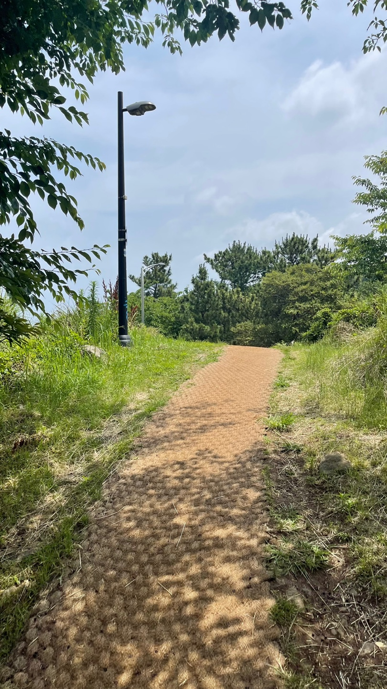

안녕하세요. 이번에는 오름 리뷰로 인사드리네요!

여자친구와 주말을 뜻깊게 보내는 프로젝트로 오름을 가보기로 했어요 찾다보니 오잉... 이런 스팟이!

제주시 화북에 위치한 별도봉은 서쪽의 사라봉과 더불어 제주 시내에 있는 대표적인 오름으로 유명한다고 하네요!
현재는 체육공원으로도 이용되고 있어요.

별도봉의 이름의 유래는 제주말 ✨✨**베리**✨✨ 에서 유래되었는데요. **바다의 절벽** 을 의미하는 뜻이라고 합니다. 
또 그 말을 한자로 표음하여 **베리오름**으로 불렸다고 합니다.

현재는 화북동의 옛 마을명이었던 별도를 따라서 최종적으로 **별도봉**이 되었다고 하네요!

## 여행 정보

### 오름명
별도봉

### 주소
제주특별자치도 제주시 화북일동 4472

[카카오지도 바로가기](http://kko.to/3eQXSreXF)

## 가는길
우당도서관 옆길로 들어갈 수 있으며, 주차도 가능합니다!

## 별도봉의 입구
별도봉 가는 길에서 왼쪽으로 갈 경우 사라봉으로 갈 수 있는데요.
또한 올레길 18코스 가는길과 같이 있어요!

물론 저희는 오른쪽으로 빠져서 한라정 방향으로 별도봉으로 갔다왔습니다.

생각보다 가파르지 않고 비교적 완만했습니다.

저희같은 초보자들도 쉽게 오를 수 있었어요! 🥰🥰🥰

## 별도봉 가는길...

산책로에 들어서자마자 왼쪽편으로 예쁜 바다가 보였어요.

왼쪽편 바다는 제주여객선터미널이 있는 곳으로 제주로 들어오는 여객선 대부분이 이쪽 바다를 이용한다고 하네요!!

구름과 바다를 벗삼아 조금씩 조금씩 걸어가봅니다...

## 별도봉의 정상

정상에 도착했습니다!!

제주항에 배는 물론, 삼양동까지 보이는데요.

좀 날씨가 좋았다면 멀리 한라산도 보일 수 있다고 하네요. 아쉽게도 오늘은 흐려서 😭😭😭

## 애기업은돌

이후에 바로 내려가기는 그래서... 올레길 18코스번 코스를 따라서 사라봉공원으로 내려가기로 했습니다.

여기 갈림길을 따라서 왼쪽으로 가기 시작했답니다.

걷기 시작하니 숲길이 나타났어요!

숲길이 지나고 나니까... 한 바위가 나타는데요! 이게 **애기업은돌** 이라고 하네요!!

그리고 다시 가보니... 너무나 예쁜 올레길 풍경이 나타났습니다!

아름답고 평화로운 제주시내와 예쁜 파랑 바다와 예쁜 녹색 숲이 조화되는

시원한 제주의 바람과 자연.... 너무나 좋았던 기억이었습니다.

모두가 가끔씩 자연속에서 힐링의 시간을 가졌으면 합니다!!