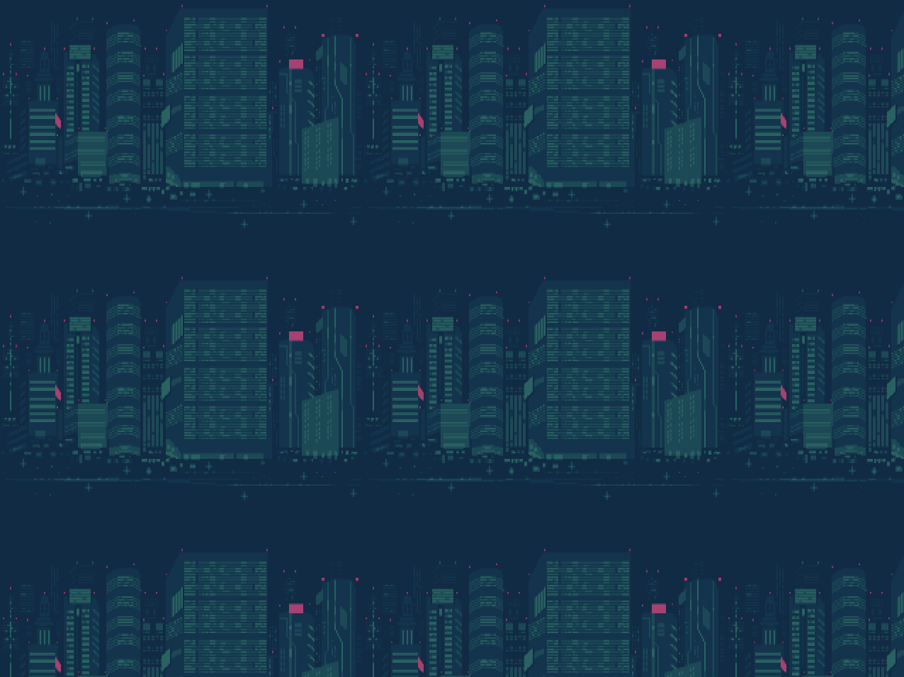
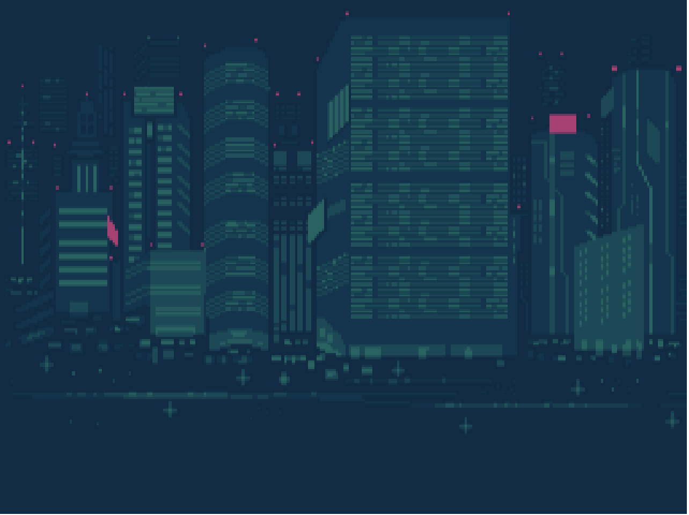
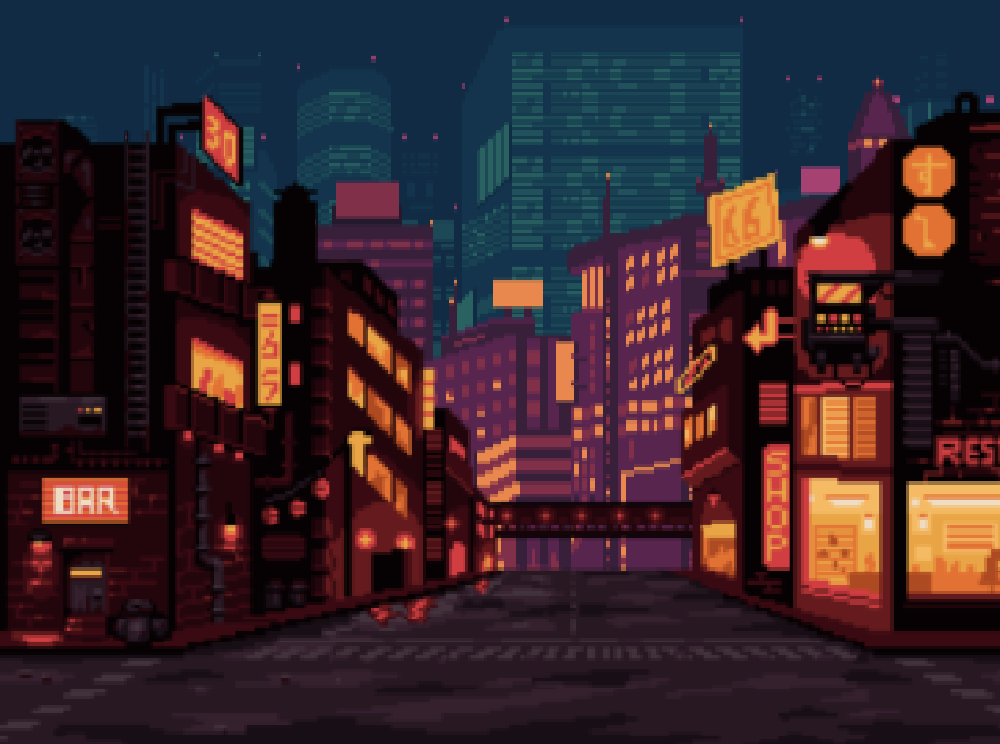

## 패럴랙스 스크롤링 (parallax scrolling) 이란?

패럴랙스 스크롤링(parallax scrolling)은 원거리에 있는 배경 이미지는 느리게 움직이게 하고, 근거리에 있는 사물 이미지는 빠르게 움직이도록 함으로써 2D 기반에서 입체감을 느낄 수 있게 만든 기법입니다. 하나의 이미지를 여러 개의 레이어(layer)로 분리한 후 스크롤에 반응하는 속도를 다르게 조정하는 방식으로 구현하게 됩니다. 1930년대부터 애니메이션 분야에 사용되던 기법이었으나, 최근에는 웹 디자인에서도 손쉽게 볼 수 있습니다.


## phaser3 코드를 작성해보자!

데모를 위해서 백그라운드 이미지가 필요합니다. 여기에서 저희는 이 [스프라이트](https://opengameart.org/content/cyberpunk-street-environment)들을 쓰겠습니다.

서로 다른 배경 이미지를 서로 다른 속도로 반복해서 보여줌으로써 입체감을 느끼게 하는게 목표입니다!

먼저 데모용 스크립트를 작성해보겠습니다.

```typescript
import Phaser from 'phaser';

class MyGame extends Phaser.Scene {
  preload() {
    // 백그라운드 이미지 로딩
  }

  create() {
    // 백그라운드 설정
  }

  update() {}
}

new Phaser.Game({
  type: Phaser.AUTO,
  backgroundColor: '#000000',
  pixelArt: true,
  antialias: false,
  roundPixels: false,
  scale: {
    mode: Phaser.Scale.NONE,
    parent: 'Phaser-Example',
    width: 640,
    height: 480,
  },
  scene: MyGame,
});
```

실제 구현을 위해서, 사용할 레이어들의 이미지들을 호출해보도록 하겠습니다.


총 위의 3가지 이미지를 사용할 예정입니다.

```typescript
  preload() {
    this.load.image("foreground", Foreground);
    this.load.image("back", Back);
    this.load.image("far", Far);
  }
```

## 가장 뒷 배경 레이어를 추가해보자!
도시 야경에서 가장 뒷 배경이 되는 이미지를 여기에서 등록해보도록 하겠습니다.


Phaser 의 [TileSprite Object](https://photonstorm.github.io/phaser3-docs/Phaser.GameObjects.TileSprite.html) 를 사용해볼 것 인데요.

텍스쳐를 반복 그리는데 최적화된 Object 입니다.

TileSprite 자체적으로 텍스쳐를 스크롤과 크기를 조정할 수 있습니다. 자동으로 래핑되며 매끄러운 텍스처를 소스로 사용하여 게임 배경을 만들 수 있도록 설계되었습니다.

다만, 실제 캔버스 크기보다 더 큰 TileSprite를 생성해서는 안 됩니다. 게임의 전체 맵을 스크롤하는 큰 반복 배경을 만들려면 캔버스 크기에 맞는 TileSprite를 만든 다음 tilePosition 속성을 사용하여 플레이어가 이동할 때 텍스처를 스크롤합니다. 만약 엄청 큰 픽셀의 사이즈를 만든다면 엄청나게 메모리를 소모하며 퍼포먼스 이슈를 발생시킨다고 하네요. 😭😭😭

> ❗️ tilePosition을 사용하여 텍스처를 스크롤하고 tileScale을 사용하여 텍스처의 크기를 조정하세요. 스프라이트 자체의 크기를 조정하거나 필요 이상으로 크게 만들지 마세요.

phaser 의 해상도를 가져와서 가득찬 크기의 TileSprite Object 를 생성해봅니다.

```typescript
  create() {
    const { width, height } = this.scale;
    
    this.add
      .tileSprite(0, 0, width, height, 'far')
      .setOrigin(0.0, 0.0);
  }
```

> ❗️ setOrigin 명령어는 object 의 배피를 중앙이 아닌 좌측, 상단을 기준으로 위치를 정의하고 싶을 수 있습니다. 이 경우는 setOrigin() 매서드를 사용합니다. 자세한 내용은 api 문서 참조하세요.



다음과 같이 반복되는 텍스쳐를 확인할 수 있겠습니다. 나중에 구름같은 배경에 쓸때 유용할 수 있겠는데요. 저희는 반복시키지 않을 것이라, setTileScaled 메소드를 활용해서 한화면 가득차도록 크게 키우도록 하겠습니다.

```typescript
  create() {
    const { width, height } = this.scale;
    const scaledWidth = width / 256;
    const scaledHeight = height / 192;
    const scaled = Math.max(scaledWidth, scaledHeight);
    
    this.add
      .tileSprite(0, 0, width, height, 'far')
      .setTileScale(scaled)
      .setOrigin(0.0, 0.0);
  }
```

texture 의 가로 세로 크기를 가지고 scale 된 사이즈를 구하고, 가장 낮은 사이즈 기준으로 scale 을 조정하였습니다.



## 남은 모두 레이어를 추가해보자!

그럼 화면 가득찬 배경을 확인할 수 있겠습니다. 이제 순서대로 나머지 두가지 레이어도 동일하게 추가할 것인데, 반복될 작업을 줄이기 위해서 TileSprite 등록하는 부분을 함수로 빼두겠습니다.

```typescript
const addScaledBackground = (scene: Phaser.Scene, asset: string, textureWidth: number, textureHeight: number) => {
  const { width, height } = scene.scale;
  const scaledWidth = width / textureWidth;
  const scaledHeight = height / textureHeight;
  const scaled = Math.max(scaledWidth, scaledHeight);

  return scene.add.tileSprite(0, 0, width, height, asset).setTileScale(scaled).setOrigin(0.0, 0.0);
};
```

위 함수들을 이용해서 tileSprite 들을 등록해봅시다.

```typescript
  create() {
    addScaledBackground(this, 'far', 256, 192);
    addScaledBackground(this, 'back', 256, 192);
    addScaledBackground(this, 'foreground', 352, 192);
  }
```



제법 그럴듯 해졌습니다! 이제 움직여 보겠습니다! 그럴려면 update 매쏘드에서 등록된 tileSprite 를 움직이도록 해볼껍니다.

## 이제 움직여보자!

```typescript
  create() {
    this.far = addScaledBackground(this, 'far', 256, 192);
    this.back = addScaledBackground(this, 'back', 256, 192);
    this.foreground = addScaledBackground(this, 'foreground', 352, 192);
  }

  update() {
    if (this.far) this.far.tilePositionX += 0.1;
    if (this.back) this.back.tilePositionX += 0.3;
    if (this.foreground) this.foreground.tilePositionX += 0.5;
  }
```


## 총평
update 메소드를 보시면 각 스피드를 다르게 지정하는게 키포인트입니다. camera 를 움직이는것도 가능하나, 다만 아까전에 공유드렸던 내용대로 tileSprite 를 무한히 키울 수 없어 게임 자체적인 크기를 유한한게 아니라면 tilePositionX / tilePositionY 를 통해서 스크롤을 구현하여야 합니다.

## 출처 및 참고

- https://ko.wikipedia.org/wiki/%ED%8C%A8%EB%9F%B4%EB%9E%99%EC%8A%A4_%EC%8A%A4%ED%81%AC%EB%A1%A4%EB%A7%81
- https://opengameart.org/content/cyberpunk-street-environment
- https://photonstorm.github.io/phaser3-docs/Phaser.GameObjects.TileSprite.html