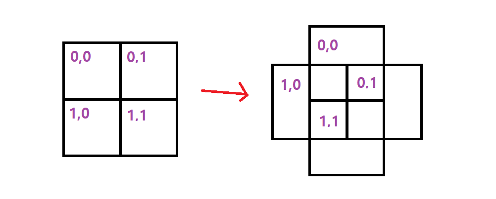

## 들어가며

여러번 2D 게임을 만들기도 하고 즐기기도 하면서 여러가지 게임 그래픽에 대한 테크닉에 대해서 공부를 해보았습니다. [참고 - 울펜슈타인3D 는 과연 어떻게 3d를 구현했을까요?](/article/raycasting-pseudo-3d/)

이번에는 그 중에서 쿼터뷰에 대해서 이야기를 해보고자 합니다.


## 등축 투영법

먼저 기본되는 원리를 알려면 **등축 투영법** 을 알아야 합니다. [참조](https://ko.wikipedia.org/wiki/%EB%93%B1%EC%B6%95_%ED%88%AC%EC%98%81%EB%B2%95)

원래는 제도 분야에서 많이 쓰이는 투영법 중 하나이지만, 게임 분야에서 복잡한 3D 계산을 하지 않고, 2D 그래픽만으로도 쉽게 표현할 수 있는 장점 때문에 많이 쓰이고 있습니다.


## 타일 기반 2D 게임

보통 2D 게임을 만들때 2D 좌표 기반으로 미리 그려진 이미지를 타일처럼
배치하는 형식으로 맵을 디자인하곤 합니다.


이번에 소개해드릴 쿼터뷰도 동일하게 타일처럼 맵을 디자인할 수 있습니다.


다만 쿼터뷰는 일반적인 2차원 좌표계랑 다른데 어떻게 구성해야 할까요?

## Cartesian 좌표계 / Isometric 좌표계

> 일반적인 x/y 2차원 좌표계는 Cartesian 이라고 부릅니다.

일반적인 2d 타일맵을 아까 이야기 했던 **등축 투영법** 방식으로 표현한 것을 아까 이야기했던 쿼터뷰 혹은 isometric 이라고 부릅니다.

아래 사진처럼 수직축으로 45도 회전시킨 다음, 이어서 수평 축으로 +/- 35.264° [= arcsin(tan(30°))] 회전시킨 것과 같습니다.


## 그럼 어떻게 표현해야 할까요?

아래 이 이미지는 32x32 사이즈의 투명한 배경을 가진 이미지입니다.


쿼터뷰는 아래 사진을 이런식으로 배치하는 형식으로 시작됩니다.


단순히 이렇게 쌓는 것으로 끝입니다.

정리하자면 일반적인 2D 맵과 달리 isometric 은 아래와 같이 겹치는 구조로 되는 것 입니다.



그렇다면 어떤 규칙으로 배치될까요?

식으로 표현하면

```javascript
const isoX = cartX - cartY;
const isoY = (cartX + cartY) / 2;
```

isometric 의 x 좌표는 기존 좌표계에서 x - y 를 뺀 값이며
(게임내 구현은 첨부된 이미지의 너비만큼 곱해야 합니다.)
y 좌표는 기존 좌표의 x + y 를 더한 값을 나눠야 합니다.

## 결과!

<div style="position: relative; height: 0; padding-bottom: 56.25%; padding-top: 25px;">
<iframe src='//labs.phaser.io/view-iframe.html?src=src/depth sorting/isometric blocks.js&v=3.55.2' style='position: absolute; top: 0; left: 0; width: 100%; height: 100%; border: 0;'></iframe>
</div>

Ref.

- [2.5D](https://en.wikipedia.org/wiki/2.5D)
- [아이소메트릭(isometric) 게임에 대한 설명 및 견해](https://rgy0409.tistory.com/608)
- [등축 투영법](https://ko.wikipedia.org/wiki/%EB%93%B1%EC%B6%95_%ED%88%AC%EC%98%81%EB%B2%95)
- [Creating Isometric Worlds: A Primer for Game Developers](https://gamedevelopment.tutsplus.com/tutorials/creating-isometric-worlds-a-primer-for-game-developers--gamedev-6511)
- [Converting X,Y grid coordinates to Crafty.js Isometric Coordinates](https://stackoverflow.com/questions/13092038/converting-x-y-grid-coordinates-to-crafty-js-isometric-coordinates/13198583)
