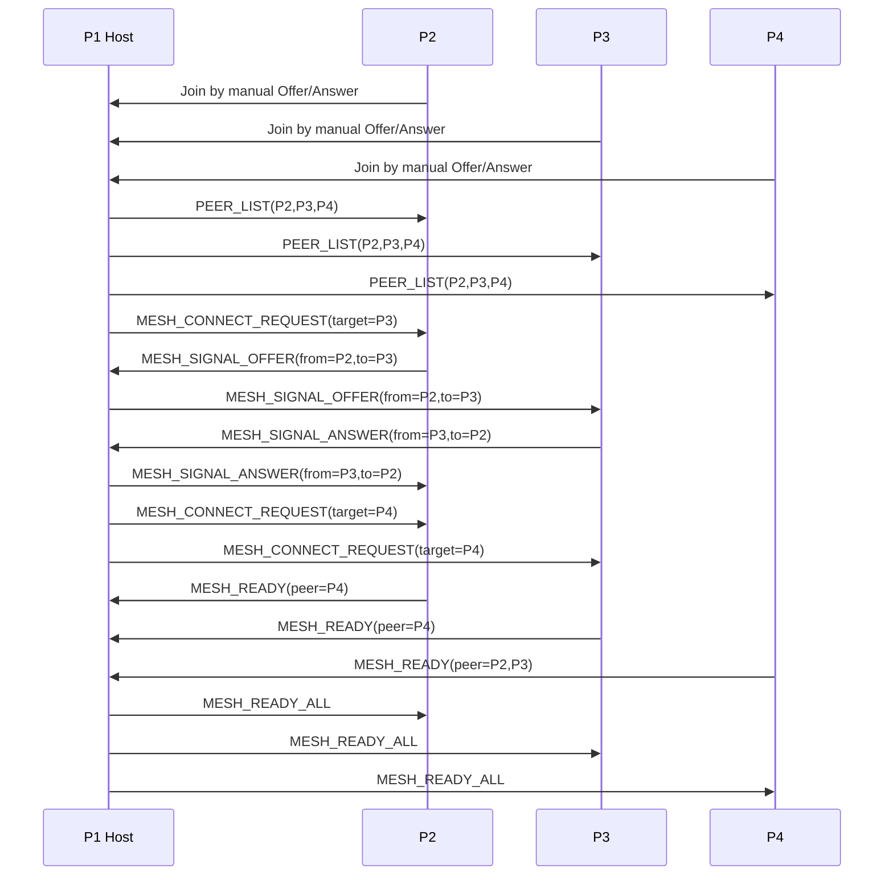

# Phaser 기반 양계장 디펜스 P2P 게임 기획안

> 작업명: **양계장 디펜스 P2P**  
> 참고 방향: 워크래프트3 유즈맵 `닭농장1.3a.w3x`의 **룰 감각과 플레이 루프만 분석**  
> 구현 방향: Phaser 기반 오리지널 웹 게임  
> 멀티 방식: **중간 게임 서버 없는 WebRTC 수동 Offer/Answer 방식**  
> 배포 목표: 친구끼리 브라우저에서 접속해서 가볍게 플레이 가능한 실시간 협동/경쟁 게임

---

## 1. 프로젝트 방향성

이 프로젝트는 워크래프트3 유즈맵 `닭농장1.3a.w3x`를 자동 포팅하거나 원본 에셋을 재사용하는 프로젝트가 아니다.

핵심 방향은 다음과 같다.

1. 기존 유즈맵의 게임 감각을 분석한다.
2. 유의미한 스크립트, 수치, 웨이브 구조, 생산 루프를 참고한다.
3. Phaser 기반으로 완전히 새 게임을 구현한다.
4. 그래픽, 사운드, UI, 이름, 아이콘은 새로 창작한다.
5. 친구끼리 플레이할 수 있도록 별도 중간 게임 서버 없이 WebRTC P2P 방식으로 구현한다.

즉, 이 프로젝트의 성격은 **원본 맵 복제**가 아니라 **추억의 유즈맵 감각을 현대 웹 게임으로 재해석하는 오리지널 구현**이다.

---

## 2. 원본 맵 활용 원칙

### 2.1 허용하는 활용

`닭농장1.3a.w3x` 파일은 다음 목적에 한해 참고한다.

- 게임 루프 분석
- 자원 생산 주기 파악
- 닭, 알, 늑대, 건물의 관계 파악
- 웨이브 시작 시간과 난이도 상승 구조 참고
- 플레이어가 초반에 어떤 선택을 하게 되는지 분석
- 타워, 울타리, 우물, 농장 등 시스템 간 상호작용 파악
- JASS 스크립트나 오브젝트 데이터에서 의미 있는 상수값 추출

### 2.2 금지하는 활용

다음은 하지 않는다.

- 원본 맵 자동 포팅
- 원본 에셋 사용
- 원본 아이콘, 모델, 사운드, UI 사용
- 원본 게임명 그대로 사용한 공개 배포
- 원본 스크립트 코드의 직접 복사
- 보호/난독화된 맵을 강제로 우회하여 복호화하는 방식

맵이 보호되어 있거나 스크립트 추출이 어렵다면, 강제로 우회하지 않고 실제 플레이 관찰과 공개된 설명을 바탕으로 룰을 재구성한다.

### 2.3 추출 분석 참조

현재 `docs/닭농장1.3a.w3x`는 표준 MPQ 해시 기반으로 일부 내부 파일 추출이 가능하다. 분석 결과와 참고 수치는 [닭농장 1.3A W3X 추출 분석 노트](./chicken_farm_w3x_analysis.md)를 기준으로 삼는다.

기획 수치 중 원본 분석에 근거한 항목:

| 항목           |      원본 분석 기준 | MVP 반영                            |
| -------------- | ------------------: | ----------------------------------- |
| 첫 늑대 안내   |                80초 | 논리 시간 80초 유지, 테스트는 배속  |
| 닭 생산 주기   |                30초 | 알/수익 생산 주기 30초              |
| 닭 등급별 수익 |      70 / 110 / 170 | 등급별 생산량 배율 참고             |
| 난이도 단계    | 쉬움~언리미트 8단계 | 원본 단계 구조 유지, UI는 단계 노출 |
| 점수 보너스    |          100~1000점 | 원본 보너스 구조를 데이터로 유지    |

---

## 3. 게임 콘셉트

### 3.1 한 줄 설명

플레이어들이 각자의 양계장을 운영하며 닭을 키우고, 알을 팔거나 부화시키고, 울타리와 타워를 지어 밤마다 몰려오는 늑대를 막는 실시간 생존형 농장 디펜스 게임.

### 3.2 핵심 재미

- 초반 닭 수를 늘릴지, 방어를 먼저 지을지 선택하는 긴장감
- 알을 팔아 골드를 얻을지, 부화시켜 닭을 늘릴지 고민하는 경제 루프
- 늑대 웨이브가 올수록 방어선이 무너지는 압박감
- 친구끼리 서로의 농장 상황을 보며 돕거나 경쟁하는 재미
- 짧은 시간 안에 판단을 계속 요구하는 실시간 운영감

### 3.3 플레이 타임과 테스트 배속

현재 내부 테스트 방향은 기존 닭농장 체험에 더 가깝게 맞추는 것이다. 따라서 기본 세션은 원본 장기 타이머를 유지하고, 빠른 검증은 별도 테스트 배속으로 해결한다.

기준:

- 기본 프로파일: 원본에 가까운 50분 이상 장기 세션
- 빠른 테스트 프로파일: 같은 타임라인을 `timeScale`로 압축
- 밸런스 데이터는 원본 초 단위를 기준으로 기록하고, 런타임에서 `effectiveDeltaSec = realDeltaSec * timeScale`로만 가속한다.

권장 테스트 배속:

| 프로파일   | timeScale | 용도                                          |
| ---------- | --------: | --------------------------------------------- |
| `original` |        1x | 최종 체감/장기 밸런스 검증                    |
| `fast`     |        3x | 50분 타임라인을 약 17분에 검증                |
| `smoke`    |       10x | 웨이브 순서, 보스 생성, 경제 이벤트 빠른 확인 |

---

## 4. 주요 게임 루프

```text
게임 시작
  ↓
농부 + 개 배치 / 시작 닭 지급
  ↓
닭이 주기적으로 알 생산
  ↓
알 판매 또는 부화 선택
  ↓
자원으로 울타리 / 타워 / 우물 / 농장 건설
  ↓
일정 시간 후 늑대 웨이브 시작
  ↓
늑대가 울타리, 닭, 농부를 공격
  ↓
방어 성공 시 보상 획득
  ↓
다음 웨이브 강화
  ↓
최후 생존 또는 제한 시간 종료
  ↓
점수 정산
```

---

## 5. 게임 모드

### 5.1 MVP 모드: 원본 근접 8인 생존전

- 최대 8인 접속을 1차 내부 테스트 목표로 둔다.
- 각자 독립된 농장 구역 보유
- 늑대 웨이브는 공통 시간 기준으로 발생
- 각 플레이어는 자신의 농장을 방어
- 점수 기준으로 순위 산정
- 공개 테스트 규모는 성능 검증 결과에 따라 조절할 수 있지만, MVP 데이터 구조와 맵 슬롯은 8인을 기준으로 잡는다.

### 5.2 추후 확장 모드

- 협동 모드: 하나의 큰 농장을 함께 방어
- 팀전 모드: 2 vs 2 농장 방어 경쟁
- 무한 웨이브 모드: 죽을 때까지 생존
- 타임어택 모드: 15분 동안 최고 점수 경쟁
- 커스텀 룰: 시작 닭 수, 웨이브 속도, 맵 크기 조절

---

## 6. 핵심 오브젝트

### 6.1 플레이어 / 농부

농부는 플레이어의 조작 캐릭터다.

역할:

- 이동
- 건물 건설
- 닭 구매 또는 배치
- 알 수집
- 수리
- 간단한 공격 또는 밀치기

MVP에서는 농부가 직접 전투를 강하게 수행하지 않도록 한다. 전투의 핵심은 타워와 울타리, 경제 운영에 둔다.

시작 유닛:

- 원본 JASS 기준 각 플레이어는 시작 위치에 `n002` 개 1기와 `H000` 농부 1기를 받는다.
- `IIilii` 1736에서 개가 먼저 생성되고, 1737에서 농부가 생성되며, 선택 유닛은 농부로 지정된다.
- MVP 초기 상태도 플레이어별 `farmer` 1기와 `dog_basic` 1기로 시작한다.
- 개는 초반 거미 사냥, 보너스 확보, 첫 방어 보조 역할을 맡는다.

### 6.1.1 아내 / 가족 테크

원본 분석에서 `H002` 아내, `n003` 아들, `n004` 딸, `n002` 개, `n00E` 큰 개, `h01W` 와이번이 확인된다. 사용자의 플레이 기억처럼 "결혼"이라는 이름의 업그레이드/테크를 통해 아내가 등장했을 가능성이 높지만, 현재 정적 문자열에서는 `결혼` 단어 자체를 직접 확인하지 못했다.

MVP에서는 이 구조를 축소하지 않고 `family_unlock` 또는 `marriage` 테크로 반영한다.

역할:

- 아내는 치료, 닭 몰이, 위기 대응 버프를 담당한다.
- 농부는 건설/수리/기본 조작의 중심이다.
- 아들/딸은 후속 보조 유닛 또는 특화 관리 유닛으로 둔다.
- 개/큰 개는 가족/방어 테크와 연결되는 보조 전투 유닛으로 둔다.

원본 단서:

| rawcode         | 이름       | 원본 단서                                 | MVP 해석                        |
| --------------- | ---------- | ----------------------------------------- | ------------------------------- |
| `H000`          | 농부       | 시작 유닛, 건설 목록 보유                 | 주 조작 캐릭터                  |
| `H002`          | 아내       | 능력 `A04I,A02K,A00U,A00T,A001,A002,AInv` | 결혼/가족 테크 핵심 보조 캐릭터 |
| `n003`          | 아들       | `requires: H002`, 건설 목록 보유          | 후속 보조 건설/방어 캐릭터      |
| `n004`          | 딸         | `requires: H002`, 치료/간호/모이 능력     | 후속 관리/치료 캐릭터           |
| `n002` / `n00E` | 개 / 큰 개 | 방어 유닛 스탯 확인                       | 보조 방어 유닛 테크             |
| `h01W`          | 와이번     | 수송/탑승 능력                            | 후반 이동/수송 보조             |

아내 스킬 후보:

| rawcode | 이름        | MVP 기능 후보                          |
| ------- | ----------- | -------------------------------------- |
| `A00T`  | 치유의 손길 | 다중 대상 치료                         |
| `A00U`  | 간호        | 단일 대상 지속 치료                    |
| `A02K`  | 질병 치료   | 원본 참조 능력. 현재 구현에서는 비활성 |
| `A00X`  | 아내의 유혹 | 닭 대규모 이동/몰이                    |
| `A04I`  | 변해라 얍!  | 늑대 변이/군중 제어                    |
| `A04L`  | 아내의 축복 | 버프/보호 효과                         |

레벨/강화:

- 원본 산출물에는 농부/아내의 unit level, 스킬 레벨 문자열, `AddHeroXPSwapped` 호출 후보가 있어 성장 구조가 있었을 가능성이 높다.
- 현재 단계에서는 정확한 경험치 공식이 확정되지 않았으므로, MVP 데이터에는 `farmerLevel`, `spouseLevel`, `familyTechLevel` 필드를 먼저 둔다.
- 실제 수치 적용은 PoC에서 `level 1~3` 정도의 치료량/범위/쿨다운 증가로 검증한다.

### 6.1.2 배럭 / 연구소 / 제작 테크

원본 분석을 다시 보면 배럭과 연구소 계열을 별도 테크 축으로 봐야 한다. 이름 그대로의 `hbar [배럭]`도 추출되지만, 커스텀 닭농장 빌드 라인에서는 `h026` 용병소가 실제 배럭 역할에 더 가깝다.

핵심 건물:

| MVP id               | 원본 rawcode | 이름        | 역할                                             |
| -------------------- | ------------ | ----------- | ------------------------------------------------ |
| `mercenary_barracks` | `h026`       | 용병소      | 가드맨/총병/환크 생산. 실제 배럭 역할            |
| `blacksmith`         | `h00B`       | 블랙스미스  | 플라잉 머신/모탈/발전기 요구조건. 공업 연구 허브 |
| `workshop`           | `h00C`       | 워크샵      | 로보 고블린/모탈/플라잉 머신/팅커 제작           |
| `arcane_lab`         | `h01H`       | 아케인 생텀 | 최상위 벽/타워/럼버밀/팅커 테크 요구조건         |
| `power_generator`    | `h01V`       | 발전기      | 블랙스미스 이후 공업 보조 건물 후보              |

유닛/연구 방향:

- 용병소는 `merc_guardman`, `merc_rifleman`, `merc_siege` 생산 라인으로 둔다.
- 워크샵은 `robot_worker`, `mortar_team`, `flying_machine`, `tinker_builder` 라인으로 둔다.
- 연구는 `guardTowerDamage`, `arcaneTowerDamage`, `dogDamage`, `dogSpeed`, `guardmanBoost`, `soldierAttackSpeed`, `automation` id로 분리한다.
- 연구 제공 건물은 `research_upgrade_provider_reference.tsv` 기준으로 시작한다. 타워 연구 `R008/R009/R006`은 발전기, 개 공격력 `R00A`는 신전, 개 속도/가드맨/총병/자동화 계열은 아케인 생텀, 표준 군사 공업은 블랙스미스에 둔다.

MVP 판단:

- 원본 경험을 줄이지 않기 위해 배럭/연구소 축은 삭제하지 않는다.
- 다만 첫 싱글 플레이 MVP에서는 용병소와 블랙스미스/워크샵 요구조건만 먼저 열고, 아케인 생텀과 최상위 연구는 후반 데이터로 유지한다.
- PoC에서는 타워/울타리 전투 감각을 먼저 검증하되, 건설 메뉴 구조는 처음부터 이 테크 확장을 담을 수 있게 만든다.

### 6.2 닭

닭은 게임의 핵심 생산 유닛이다.

역할:

- 일정 시간마다 알 생산
- 늑대의 주요 공격 대상
- 많이 보유할수록 경제력이 상승
- 방어가 부족하면 대량 손실 발생

기본 속성 예시:

```json
{
    "buyCostGold": 30,
    "eggAmount": 1,
    "eggIntervalSec": 30,
    "hp": 30,
    "id": "chicken_basic",
    "moveSpeed": 40,
    "name": "기본 닭"
}
```

### 6.3 알

알은 판매하거나 부화시킬 수 있는 중간 자원이다.

선택지:

- 판매: 즉시 골드 획득
- 부화: 일정 시간 후 닭 증가

이 선택이 초반 운영의 핵심이 된다.

예시:

```json
{
    "hatchResult": "chicken_basic",
    "hatchTimeSec": 20,
    "id": "egg_basic",
    "sellGold": 10
}
```

### 6.4 울타리

울타리는 늑대의 이동을 막는 기본 방어 건물이다.

역할:

- 늑대 경로 차단
- 농장 내부 보호
- 타워가 공격할 시간을 벌어줌
- 수리 가능

예시:

```json
{
    "buildTimeSec": 2,
    "costWood": 5,
    "hp": 100,
    "id": "fence_wood",
    "name": "나무 울타리",
    "repairCostWood": 1
}
```

원본 근접 구현에서는 단일 울타리만 두지 않고, `h003 -> h00L -> h00K -> h00Y -> h014 -> h01D -> h01G` 라인을 참고한다. MVP 첫 구현은 `fence_wood`, `fence_bronze`, `wall_stone`, `barrier_magic` 4단계까지 우선 열고, 후반 결계/오벨리스크/플라즈마 벽은 데이터만 유지한다.

### 6.5 타워

타워는 늑대를 공격하는 자동 방어 건물이다.

역할:

- 사거리 내 늑대 자동 공격
- 업그레이드 가능
- 울타리와 조합되어 방어선 형성

예시:

```json
{
    "attackCooldownMs": 900,
    "costGold": 20,
    "costWood": 15,
    "damage": 5,
    "hp": 150,
    "id": "tower_basic",
    "name": "감시 타워",
    "range": 130,
    "targetPriority": "nearest"
}
```

원본 근접 구현에서는 `tower_basic` 단일 타워가 아니라 다음 분기형 라인을 사용한다.

| 라인      | 원본 rawcode                           | MVP id           | 역할                                    |
| --------- | -------------------------------------- | ---------------- | --------------------------------------- |
| 공통 시작 | `h00D`                                 | `tower_scout`    | 저렴한 시작 타워, 이후 분기             |
| 가드      | `h007 -> h00Q -> h00Z -> h00R -> h01J` | `tower_guard_*`  | 비교적 저렴하고 안정적인 일반 공격 타워 |
| 아케인    | `h016 -> h008 -> h017 -> h01K`         | `tower_arcane_*` | 비싸지만 빠른 chaos 공격 타워           |

`R008`/`R009`의 3레벨 공격력 연구는 타워 라인 구현 이후 별도 `damageResearchLevel`로 추가한다.

### 6.6 우물

우물은 농장 유지와 회복을 담당한다.

역할:

- 주변 닭 또는 건물 회복
- 농장 운영 안정화
- 초반 경제와 방어 사이의 선택지를 제공

MVP에서는 우물의 효과를 단순화한다.

예시:

```json
{
    "costGold": 30,
    "costWood": 20,
    "healPerSec": 1,
    "healRange": 120,
    "id": "well_basic",
    "name": "우물"
}
```

### 6.7 늑대

늑대는 메인 적 유닛이다.

역할:

- 웨이브 단위로 출현
- 울타리, 닭, 농부를 공격
- 시간이 지날수록 체력/공격력/숫자 증가

예시:

```json
{
    "attackCooldownMs": 1000,
    "damage": 5,
    "hp": 40,
    "id": "wolf_basic",
    "moveSpeed": 55,
    "name": "늑대",
    "score": 10
}
```

---

## 7. 경제 시스템

### 7.1 자원

MVP 기준 자원은 3개로 시작한다.

| 자원 | 용도                           |
| ---- | ------------------------------ |
| 골드 | 닭 구매, 타워 건설, 업그레이드 |
| 나무 | 울타리, 타워, 수리             |
| 알   | 판매 또는 부화                 |

### 7.2 초반 의사결정

초반에는 다음 선택지가 경쟁해야 한다.

- 닭을 늘려 경제력을 키운다.
- 알을 팔아 빠르게 타워를 짓는다.
- 울타리를 먼저 지어 늑대 접근을 막는다.
- 우물로 장기 생존을 준비한다.

좋은 밸런스는 “한 가지 정답 빌드”가 아니라, 상황과 친구들의 플레이 스타일에 따라 선택이 갈리는 구조다.

---

## 8. 웨이브 시스템

### 8.1 기본 구조

- 게임 시작 후 80초부터 첫 늑대 웨이브 발생
- 이후 30~45초마다 웨이브 발생
- 시간이 지날수록 늑대 수, 체력, 공격력 증가
- 일정 웨이브마다 특수 늑대 등장 가능

예시:

```json
{
    "intervalSec": 35,
    "startSec": 80,
    "waves": [
        {
            "wave": 1,
            "wolf": "wolf_basic",
            "count": 3,
            "hpMultiplier": 1.0,
            "damageMultiplier": 1.0
        },
        {
            "wave": 2,
            "wolf": "wolf_basic",
            "count": 5,
            "hpMultiplier": 1.1,
            "damageMultiplier": 1.0
        },
        {
            "wave": 3,
            "wolf": "wolf_basic",
            "count": 7,
            "hpMultiplier": 1.2,
            "damageMultiplier": 1.1
        }
    ]
}
```

### 8.2 난이도 설계

MVP에서는 다음 기준으로 조정한다.

- 초보자도 첫 3웨이브는 버틸 수 있어야 한다.
- 5웨이브부터 방어선 구성이 중요해진다.
- 8웨이브 이후에는 닭 경제가 충분하지 않으면 버티기 어렵다.
- 10웨이브 이후는 점수 경쟁 구간으로 본다.

---

## 9. 점수 시스템

점수는 다음 요소로 구성한다.

| 항목                        |  점수 |
| --------------------------- | ----: |
| 늑대 처치                   |   +10 |
| 특수 늑대 처치              |   +30 |
| 생존 시간 10초당            |    +5 |
| 보유 닭 1마리당 최종 보너스 |   +20 |
| 보유 골드 최종 보너스       | +소량 |
| 농부 사망                   |  -100 |
| 닭 사망                     |    -5 |

MVP에서는 점수 승리와 생존 승리를 함께 사용한다.

- 제한 시간까지 생존한 플레이어 중 점수 1등 승리
- 모든 플레이어가 사망하면 가장 오래 버틴 플레이어 승리

---

## 10. 멀티플레이 방향

## 10.1 방식 A: 완전 수동 WebRTC Offer/Answer

중간 게임 서버 없이 플레이어끼리 직접 연결한다.

기본 흐름:

```text
1. 방장이 방 생성
2. 방장 브라우저가 WebRTC Offer 생성
3. 방장이 Offer 코드를 복사해서 친구에게 전달
4. 친구가 참가 화면에 Offer 코드 붙여넣기
5. 친구 브라우저가 Answer 코드 생성
6. 친구가 Answer 코드를 방장에게 전달
7. 방장이 Answer 코드 붙여넣기
8. P2P 연결 완료
9. 게임 시작
```

전달 수단은 카카오톡, 디스코드, 메신저, 음성 채팅 등 외부 수단을 사용한다.

이 방식에서는 별도의 로비 서버, 매칭 서버, 게임 서버를 만들지 않는다.

---

## 10.2 장점

- 서버 비용 없음
- 백엔드 없이 정적 호스팅만으로 배포 가능
- 친구끼리 가볍게 테스트 가능
- 개인 프로젝트/MVP로 부담이 작음
- Cloudflare Pages, GitHub Pages 같은 정적 배포와 잘 맞음

---

## 10.3 단점

- Offer/Answer 코드를 직접 주고받아야 하므로 UX가 불편함
- NAT 환경에 따라 연결 실패 가능
- 브라우저/네트워크 환경 영향을 받음
- 방장 브라우저가 사실상 호스트 역할을 하므로 방장에게 부하가 집중됨
- 방장이 완전히 이탈하면 즉시 자동 복구가 어렵다
- 중간 신호 서버가 없기 때문에 방장 이관 시에도 새로운 Offer/Answer 코드를 수동으로 교환해야 한다
- 1시간 이상 장기 세션에서는 네트워크 끊김, 브라우저 종료, 절전 모드, 새로고침으로 인한 방폭 리스크가 존재한다

MVP에서는 방장 이탈 시 게임 종료를 기본 처리로 둔다.
다만 장기 세션 안정성을 위해 후속 단계에서 **수동 방장 이관**과 **복구 가능한 체크포인트 저장**을 도입한다.

---

## 10.4 네트워크 모델

MVP에서는 **Host Authoritative P2P** 방식을 사용한다.

```text
방장 브라우저
  - 전체 게임 시뮬레이션 기준
  - 웨이브 생성
  - 늑대 AI 계산
  - 충돌/공격 판정
  - 자원/점수 판정
  - 주기적으로 상태 전송
  - 주기적으로 복구용 체크포인트 생성

참가자 브라우저
  - 입력 명령 전송
  - 방장 상태를 받아 화면 반영
  - 최근 상태 스냅샷을 로컬에 보관
  - 방장 끊김 감지 시 복구 대기 상태로 전환
```

참가자는 직접 게임 상태를 결정하지 않고, 명령만 보낸다.

예시 명령:

```json
{
    "buildingId": "fence_wood",
    "clientTick": 4210,
    "playerId": "p2",
    "type": "BUILD_REQUEST",
    "x": 12,
    "y": 8
}
```

방장이 검증 후 전체 상태에 반영한다.

방장 상태 브로드캐스트 예시:

```json
{
    "buildings": [],
    "chickens": [],
    "hostEpoch": 1,
    "players": [],
    "resources": {},
    "scores": {},
    "serverTick": 4230,
    "type": "STATE_SNAPSHOT",
    "wolves": []
}
```

장기적으로는 방장 이관을 고려하여 `serverTick`, `hostEpoch`, `lastAppliedCommandId`, `stateChecksum`을 상태 스냅샷에 포함한다.

---

## 10.5 통신 채널

WebRTC DataChannel은 목적별로 2개를 고려한다.

### reliable 채널

중요한 게임 명령을 전달한다.

- 건설 요청
- 판매 요청
- 부화 요청
- 수리 요청
- 게임 시작
- 준비 완료
- 결과 정산

### fast 채널

손실되어도 큰 문제가 없는 데이터를 전달한다.

- 커서 위치
- 핑 표시
- 간단한 감정표현
- 선택 표시

MVP에서는 reliable 채널 하나만 사용해도 된다.

---

## 10.6 동기화 주기

MVP 권장값:

| 항목             |           값 |
| ---------------- | -----------: |
| 시뮬레이션 tick  |    20 tick/s |
| 상태 스냅샷 전송 |     5~10회/s |
| 명령 처리        | 즉시 큐 반영 |
| 핑 측정          |      2초마다 |

처음에는 부드러운 실시간 액션보다 **일관된 게임 상태**를 우선한다.

## 10.7 방장 이탈과 방장 이관 정책

### 10.7.1 기본 판단

방장 이관은 가능하지만 MVP의 필수 기능으로 보지는 않는다.

이유는 다음과 같다.

- 현재 구조는 방장 브라우저가 유일한 권위 서버 역할을 한다.
- 방장이 끊기면 참가자들은 더 이상 확정 상태를 받을 수 없다.
- 방식 A는 신호 서버가 없기 때문에 새 방장 연결도 자동으로 처리하기 어렵다.
- 새 방장을 만들려면 참가자들이 새 Offer/Answer 코드를 다시 교환해야 한다.
- 완전 자동 이관을 구현하려면 참가자 간 mesh 연결, 상태 복제, 명령 로그, 호스트 선출, 충돌 해결이 필요하다.

따라서 단계별 접근을 사용한다.

| 단계 | 정책                   | 설명                                                        |
| ---- | ---------------------- | ----------------------------------------------------------- |
| MVP  | 방장 이탈 시 게임 종료 | 구현 단순성 우선                                            |
| v1   | 방장 수동 이관         | 방장이 나가기 전에 다른 참가자에게 호스트 권한 전달         |
| v1.5 | 방장 끊김 후 수동 복구 | 가장 최신 스냅샷을 가진 참가자가 새 방장이 되고 코드 재교환 |
| v2   | 자동 방장 이관         | mesh 연결, host election, command log replay 기반 자동 복구 |

---

### 10.7.2 MVP 처리

MVP에서는 방장 연결이 끊기면 게임을 일시 정지한 뒤 종료 안내를 띄운다.

```text
방장 연결이 끊겼습니다.
현재 버전에서는 게임을 계속할 수 없습니다.
결과 화면으로 이동하거나 새 방을 만들어 다시 시작하세요.
```

이때 각 참가자는 마지막으로 받은 스냅샷을 로컬에 임시 저장한다.
이 저장값은 MVP에서는 디버깅과 결과 표시용으로만 사용한다.

---

### 10.7.3 v1: 계획된 방장 이관

방장이 직접 나가려는 경우에는 수동 방장 이관을 지원한다.

흐름:

```text
1. 방장이 "방장 넘기기" 버튼 클릭
2. 새 방장 후보 선택
3. 현재 게임 상태 전체 스냅샷 생성
4. 새 방장에게 HOST_TRANSFER_REQUEST 전송
5. 새 방장이 상태를 검증하고 수락
6. 기존 방장이 HOST_TRANSFER_COMMIT 전송
7. 모든 참가자가 hostId와 hostEpoch 갱신
8. 새 방장이 이후 tick부터 STATE_SNAPSHOT 전송
9. 기존 방장은 일반 참가자로 전환하거나 퇴장
```

이 방식은 기존 방장이 아직 연결되어 있을 때만 가능하다.
따라서 구현 난이도는 비교적 낮고, 1시간 이상 플레이에서 “방장이 잠깐 나가야 하는 상황”을 완화할 수 있다.

---

### 10.7.4 v1.5: 끊김 후 수동 복구

방장이 예고 없이 끊긴 경우에는 완전 자동 이관 대신 수동 복구를 지원한다.

흐름:

```text
1. 참가자들이 방장 연결 끊김 감지
2. 게임 화면을 즉시 pause 상태로 전환
3. 각 참가자는 자신이 가진 최신 스냅샷 tick을 표시
4. 가장 최신 tick을 가진 참가자가 새 방장 후보가 됨
5. 새 방장이 "복구 방 만들기" 클릭
6. 새 방장이 새로운 Offer 코드를 생성
7. 나머지 참가자들이 새 Offer 코드를 붙여넣고 Answer 코드를 전달
8. 새 방장은 마지막 체크포인트에서 게임을 재개
9. hostEpoch를 1 증가시키고 기존 host의 미처리 명령은 폐기
```

이 방식은 완전 자동 복구는 아니지만, 서버 없는 방식 A의 제약을 유지하면서 방폭 피해를 줄일 수 있다.

복구 시 원칙:

- 마지막 확정 스냅샷 기준으로 재개한다.
- 끊김 직전 1~5초 정도의 입력은 유실될 수 있다.
- 복구 중에는 모든 플레이어 입력을 막는다.
- 복구 후 `hostEpoch`를 증가시켜 이전 방장 메시지를 무시한다.
- 이전 방장이 뒤늦게 재접속하더라도 자동으로 방장 권한을 되찾지 않는다.

---

## 10.8 방장 선출 규칙

방장 이탈 후 수동 복구를 위해 단순한 방장 선출 규칙을 둔다.

우선순위:

1. 가장 최신 `confirmedTick` 스냅샷을 가진 참가자
2. 동률이면 가장 낮은 `joinOrder`
3. 그래도 동률이면 가장 낮은 `playerId`
4. 사용자가 직접 선택한 후보가 있으면 수동 선택 우선

예시:

```json
{
    "joinOrder": 2,
    "lastConfirmedTick": 18240,
    "lastSnapshotId": "snapshot_18240_abc",
    "playerId": "p3",
    "stateChecksum": "9fd2a1",
    "type": "HOST_CANDIDATE_ANNOUNCE"
}
```

방장 후보는 자신의 최신 스냅샷을 기준으로 새 게임 세션을 연다.

새 방장은 다음 값을 증가시킨다.

```json
{
    "hostEpoch": 2,
    "newHostId": "p3",
    "previousHostId": "p1",
    "resumeFromTick": 18240
}
```

모든 네트워크 메시지는 `hostEpoch`를 포함한다.
클라이언트는 현재 `hostEpoch`보다 낮은 메시지를 무시한다.

---

## 10.9 복구용 스냅샷과 명령 로그

방장 이관을 위해 모든 참가자는 최근 상태를 보관한다.

### 10.9.1 스냅샷

방장은 주기적으로 전체 상태 스냅샷을 전송한다.

권장값:

| 항목                  |          값 |
| --------------------- | ----------: |
| 일반 상태 스냅샷      |    5~10회/s |
| 복구용 체크포인트     |  5~10초마다 |
| 참가자 로컬 보관 개수 | 최근 6~12개 |
| 복구 허용 손실        |      1~10초 |

복구용 체크포인트는 일반 렌더링용 스냅샷보다 안정성을 우선한다.

포함해야 할 데이터:

- 게임 시간
- hostTick
- hostEpoch
- 난이도
- RNG seed 또는 RNG state
- 플레이어 상태
- 자원 상태
- 점수 상태
- 닭/알/늑대/건물 상태
- 웨이브 진행 상태
- 이벤트 진행 상태
- 마지막 처리 명령 ID
- 상태 checksum

예시:

```json
{
    "gameTimeSec": 912,
    "hostEpoch": 1,
    "hostTick": 18240,
    "lastAppliedCommandId": "cmd_8812",
    "rngState": "seed-or-state",
    "state": {
        "players": [],
        "chickens": [],
        "eggs": [],
        "wolves": [],
        "buildings": [],
        "waves": {},
        "resources": {},
        "scores": {}
    },
    "stateChecksum": "9fd2a1",
    "type": "RECOVERY_CHECKPOINT"
}
```

### 10.9.2 명령 로그

방장은 최근 명령 로그를 보관한다.

목적:

- 디버깅
- 싱크 불일치 분석
- 향후 replay/recover 확장

MVP에서는 명령 로그 replay를 필수로 구현하지 않는다.
v1.5에서는 마지막 체크포인트 이후 명령은 폐기하고 체크포인트 기준으로 재개한다.
v2에서만 체크포인트 + 명령 로그 replay를 검토한다.

---

## 10.10 방장 이관 네트워크 메시지 타입

방장 이관을 고려하여 다음 메시지를 추가한다.

```ts
export type NetworkMessage =
    | HelloMessage
    | ReadyMessage
    | StartGameMessage
    | PlayerInputMessage
    | BuildRequestMessage
    | SellEggMessage
    | HatchEggMessage
    | RepairRequestMessage
    | StateSnapshotMessage
    | RecoveryCheckpointMessage
    | HostHeartbeatMessage
    | HostTransferRequestMessage
    | HostTransferAcceptMessage
    | HostTransferCommitMessage
    | HostLostMessage
    | HostCandidateAnnounceMessage
    | ResumeFromCheckpointMessage
    | GameOverMessage;
```

예시:

```ts
export interface HostHeartbeatMessage {
    type: 'HOST_HEARTBEAT';
    hostId: string;
    hostEpoch: number;
    hostTick: number;
    sentAt: number;
}

export interface RecoveryCheckpointMessage {
    type: 'RECOVERY_CHECKPOINT';
    hostId: string;
    hostEpoch: number;
    hostTick: number;
    gameTimeSec: number;
    lastAppliedCommandId: string;
    stateChecksum: string;
    state: SerializedGameState;
}

export interface HostTransferRequestMessage {
    type: 'HOST_TRANSFER_REQUEST';
    fromHostId: string;
    toPlayerId: string;
    hostEpoch: number;
    checkpoint: RecoveryCheckpointMessage;
}

export interface HostTransferAcceptMessage {
    type: 'HOST_TRANSFER_ACCEPT';
    newHostId: string;
    acceptedHostEpoch: number;
    acceptedTick: number;
    stateChecksum: string;
}

export interface HostTransferCommitMessage {
    type: 'HOST_TRANSFER_COMMIT';
    previousHostId: string;
    newHostId: string;
    newHostEpoch: number;
    resumeFromTick: number;
    stateChecksum: string;
}

export interface HostCandidateAnnounceMessage {
    type: 'HOST_CANDIDATE_ANNOUNCE';
    playerId: string;
    lastConfirmedTick: number;
    lastSnapshotId: string;
    joinOrder: number;
    stateChecksum: string;
}

export interface ResumeFromCheckpointMessage {
    type: 'RESUME_FROM_CHECKPOINT';
    newHostId: string;
    newHostEpoch: number;
    resumeFromTick: number;
    checkpoint: RecoveryCheckpointMessage;
}
```

---

## 10.11 끊김 감지와 일시 정지

방장 연결 상태는 다음 기준으로 감지한다.

- WebRTC connection state가 disconnected 또는 failed로 전환
- 일정 시간 이상 `HOST_HEARTBEAT` 미수신
- 일정 시간 이상 `STATE_SNAPSHOT` 미수신
- DataChannel close 이벤트 발생

권장 기준:

| 항목           |                           값 |
| -------------- | ---------------------------: |
| heartbeat 주기 |                          2초 |
| 경고 표시      |              5초 이상 미수신 |
| 일시 정지      |              8초 이상 미수신 |
| 방장 상실 판정 | 15초 이상 미수신 또는 failed |
| 복구 모드 진입 |       방장 상실 판정 후 즉시 |

처리 흐름:

```text
정상
  ↓
방장 heartbeat 지연
  ↓
화면 상단에 "방장 연결 불안정" 표시
  ↓
8초 이상 미수신 시 게임 일시 정지
  ↓
15초 이상 미수신 시 방장 상실 판정
  ↓
MVP: 게임 종료
  ↓
v1.5: 수동 복구 모드 진입
```

---

## 11. Phaser 구현 구조

### 11.1 기술 스택

- Phaser
- TypeScript
- Vite
- React 선택 적용
- WebRTC DataChannel
- 정적 배포: Cloudflare Pages 또는 GitHub Pages

React는 필수는 아니지만 다음 영역에 사용하면 좋다.

- 메인 메뉴
- 방 생성/참가 화면
- Offer/Answer 복사 UI
- 결과창
- 설정 화면

게임 본체는 Phaser Scene에서 처리한다.

---

## 11.2 폴더 구조 예시

```text
chicken-farm-defense/
  package.json
  vite.config.ts
  src/
    main.ts
    app/
      App.tsx
      routes/
        HomePage.tsx
        HostRoomPage.tsx
        JoinRoomPage.tsx
    game/
      PhaserGame.ts
      scenes/
        BootScene.ts
        PreloadScene.ts
        MenuScene.ts
        FarmScene.ts
        ResultScene.ts
      entities/
        Farmer.ts
        Chicken.ts
        Egg.ts
        Wolf.ts
        Building.ts
      systems/
        EconomySystem.ts
        BuildSystem.ts
        ChickenSystem.ts
        EggSystem.ts
        WaveSystem.ts
        TowerSystem.ts
        EnemyAISystem.ts
        ScoreSystem.ts
        NetworkSystem.ts
      network/
        WebRtcHost.ts
        WebRtcClient.ts
        MessageTypes.ts
        SnapshotSerializer.ts
      data/
        units.json
        buildings.json
        waves.json
        balance.json
      utils/
        Grid.ts
        MathUtil.ts
        Random.ts
        EventBus.ts
    assets/
      sprites/
      audio/
      ui/
```

---

## 12. 맵 구조

MVP에서는 타일 기반 2D 탑다운 맵을 사용한다. 원본과 유사한 2D 농장 배치, 시작 위치, 늑대 스폰 rect, 늑대의 돌, 정적 장애물, 거미/중립 유닛 배치를 유지하려면 Phaser Tilemap 기반이 가장 안전하다.

### 12.1 맵 구성

- 플레이어별 농장 구역
- JASS 기준 늑대 스폰 rect 13개
- 모서리/4방향의 `n01D` 거미 8개
- `n00D` 늑대의 돌 13개
- 건설 가능 영역
- 건설 불가 영역
- 길 또는 자연 장애물
- 원본 참조 거미/중립 유닛 배치
- 장식/장애물 레이어

### 12.2 8인 기준 배치 방향

```text
+---------------------------------------+
| P5 농장       | P3 농장       | P7 농장 |
|               |               |         |
| P10 농장      |  중앙/공통 압박 | P8 농장 |
|               |               |         |
| P9 농장       | P6 농장       | P1/P2  |
+---------------------------------------+
```

원본 시작 좌표는 `map_start_locations.tsv`를 기준으로 하되, 8인 테스트에서는 슬롯 0~7을 우선 사용한다. 원본에는 10개 유저 슬롯이 확인되지만, 브라우저 P2P 내부 테스트의 현실적인 상한은 8명으로 잡는다.

MVP에서는 농장 구역을 완전히 분리한 대칭 맵보다, 원본 시작 위치의 거리감과 외곽 스폰 압박을 더 살린 단일 공유 맵을 우선한다. 공정성 문제가 크면 이후 테스트 전용 대칭 맵을 별도 프리셋으로 둔다.

### 12.3 Phaser Tilemap 검토

결론: 원본 근접 테스트 프로파일은 Phaser Tilemap 사용을 권장한다.

| 선택지            | 장점                                                                       | 단점                                                    | 판단                     |
| ----------------- | -------------------------------------------------------------------------- | ------------------------------------------------------- | ------------------------ |
| 수동 좌표/도형 맵 | 빠르게 시작 가능, 의존 구조 단순                                           | 원본형 지형/장애물/장식 레이어가 커질수록 관리가 어려움 | smoke prototype에만 적합 |
| Phaser Tilemap    | 타일 레이어, collision layer, object layer, spawn marker 관리가 자연스러움 | Tiled/JSON 파이프라인과 좌표 변환 규칙이 필요           | 원본 근접 MVP 기본값     |
| 완전 절차 생성    | 반복 테스트와 대칭성 확보 쉬움                                             | 원본 농장 배치 감각이 약해짐                            | 후속 커스텀 모드 후보    |

권장 Tilemap 레이어:

| 레이어             | 용도                                                     |
| ------------------ | -------------------------------------------------------- |
| `ground`           | 잔디/흙/길 등 시각 타일                                  |
| `buildable`        | 플레이어 건설 가능 여부                                  |
| `collision_static` | 바위, 절벽, 물, 장식 장애물                              |
| `farm_zones`       | 플레이어별 농장/시작 권역                                |
| `spawns`           | 늑대 스폰 rect 13개, 보스 스폰, 거미 8개, 늑대의 돌 배치 |
| `decor`            | 직접 충돌하지 않는 장식                                  |

거미 배치:

- `unit_rawcode_crosscheck.tsv` 기준 거미 후보는 `n01B` 독 거미, `n01C` 독 거미 새끼, `n01D` 거미다.
- 원본과 동일한 경험을 원하면 거미를 단순 장식이 아니라 중립/지역 위험 요소로 둔다.
- 원본 안내문에는 "초반 거미를 잡으시면 돈을 주니 꼭 잡으세요"가 존재한다.
- 정적 분석상 `n01D` 거미는 8개 지점에 배치되고, 사망 시 50% 확률로 `I00G`를 드랍한다.
- `I00G`는 농부가 사용하면 `n011` 중년 닭을 생성하므로, MVP에서는 "초반 경제 보너스"로 해석한다.
- `n00D` 늑대의 돌은 13개 지점에 배치되며 파괴 시 점수 +100 보너스가 확인된다.
- 좌표는 별도 산출물로 분리한다. 우선 `jass_create_units.tsv`, `unit_rawcode_crosscheck.tsv`, 필요하면 추가 파서로 unit placement를 보완한다.
- 구현에서는 `spawns` object layer에 `type: "spider"`와 `sourceRawcode`를 남기고, 에셋은 새로 제작한다.

PoC 1 보정:

- 초기 PoC에서 모서리/4방향 8개 마커를 `wolf_spawn`으로 임시 표기했으나, W3X 교차표와 플레이 기억을 기준으로 이는 `n01D` 거미/초반 보너스 위치로 해석한다.
- 늑대 일반 웨이브 위치는 `jass_wolf_spawn_points.tsv`의 13개 rect를 `wolf_spawn_rect`로 별도 표시한다.
- `n00D` 늑대의 돌은 원본상 13개가 확정되어 있으나 좌표 산출물이 아직 분리되지 않았으므로, PoC 1에서는 각 늑대 rect 근처에 임시 근사 배치한다.
- 즉, `SP`는 초반 처치/보너스용 중립 거미, `WF`는 실제 웨이브 생성 rect, `STONE`은 파괴 보너스가 있는 늑대의 돌로 분리한다.

---

## 13. w3x 분석 계획

### 13.1 목적

원본 맵을 그대로 옮기는 것이 아니라, 다음 항목을 참고하기 위해 분석한다.

- 시작 자원
- 시작 닭 수
- 닭 생산 주기
- 알 판매 가치
- 알 부화 시간
- 늑대 첫 등장 시간
- 웨이브 간격
- 늑대 체력/공격력 증가 방식
- 건물 가격
- 타워 사거리/공격 속도 감각
- 게임 종료 조건

---

## 13.2 추출 대상 파일

`.w3x` 내부에서 다음 파일을 우선 확인한다.

| 파일             | 목적                                     |
| ---------------- | ---------------------------------------- |
| war3map.j        | JASS 트리거/타이머/웨이브/게임 로직 확인 |
| war3map.wts      | 문자열 테이블, 유닛/건물 이름 확인       |
| war3map.w3i      | 맵 기본 정보 확인                        |
| war3map.w3u      | 커스텀 유닛 데이터 확인                  |
| war3map.w3a      | 커스텀 능력 데이터 확인                  |
| war3map.w3t      | 아이템 데이터 확인                       |
| war3mapUnits.doo | 배치 유닛/오브젝트 확인                  |

---

## 13.3 분석 결과물

분석 결과는 다음 JSON으로 재정리한다.

```text
data/extracted/
  original_summary.md
  original_units_summary.json
  original_buildings_summary.json
  original_waves_summary.json
  original_triggers_summary.md
```

이 파일들은 직접 구현에 복사해 넣는 것이 아니라, 밸런스 참고 자료로만 사용한다.

최종 게임 데이터는 별도 파일로 관리한다.

```text
data/game/
  units.json
  buildings.json
  waves.json
  economy.json
  scoring.json
```

---

## 13.4 스크립트 분석 시 주의점

JASS 스크립트에서 다음 패턴을 찾는다.

- TimerStart
- CreateUnit
- UnitAddAbility
- SetPlayerState
- GetTriggerUnit
- TriggerRegisterTimerEvent
- TriggerRegisterUnitEvent
- IssuePointOrder
- SetUnitLifeBJ
- AdjustPlayerStateBJ

단, 원본 함수를 그대로 이식하지 않고 다음 식으로 의미만 정리한다.

예시:

```text
원본에서 80초 후 늑대 생성 트리거 확인
→ Phaser WaveSystem의 firstWaveDelaySec = 80 으로 참고
```

```text
원본에서 닭이 특정 주기로 알 생성
→ Phaser ChickenSystem의 eggIntervalSec 후보값으로 참고
```

---

## 14. PoC 로드맵

PoC는 완성 게임이 아니라, 구현 리스크와 원본 체감 재현 여부를 단계별로 검증하는 작은 실행 단위다. 실제 싱글 플레이가 처음부터 끝까지 되는 순간을 MVP/MVC 기준으로 보고, 그 전까지는 아래 PoC를 순서대로 쌓는다.

### 14.1 PoC 기준

| 구분        | 목적                       | 완료 기준                                                      |
| ----------- | -------------------------- | -------------------------------------------------------------- |
| PoC         | 기술/감각 단위 검증        | 한 화면 또는 제한된 상황에서 핵심 동작이 관찰됨                |
| MVP/MVC     | 실제 싱글 플레이 루프 검증 | 시작, 운영, 웨이브, 보상, 패배/승리, 결과가 한 세션으로 이어짐 |
| 내부 테스트 | 원본 근접 체감 검증        | 8인 슬롯, 원본 논리 타임라인, 테스트 배속으로 반복 플레이 가능 |

### 14.2 PoC 단계

| 단계 | 이름                     | 검증 목표                                                                                                                        | 주요 산출물                                                                                                   |
| ---: | ------------------------ | -------------------------------------------------------------------------------------------------------------------------------- | ------------------------------------------------------------------------------------------------------------- |
|    1 | Tilemap 맵 PoC           | Phaser 포함 Tilemap으로 닭농장과 유사한 2D 맵, 시작 위치, farm zone, buildable/collision layer를 표현                            | `FarmScene`, `games/chicken-farm/assets/tilemaps/chicken_farm_poc_01.json`, Kenney Tiny Town 임시 타일셋      |
|    2 | 늑대/방벽/공격 건물 PoC  | 두 공격 타워와 울타리 배치에서 늑대가 A\*로 우회하고, 타워 피격에 따라 목표를 전환하며, 완전히 막혔을 때만 blocker를 공격하는 감각 확인 | 진행: `FarmScene` debug combat PoC, `systems/pathing.ts` A\* grid path, `buildingTemplates`, `pathing.wolfAi` |
|    3 | 원본 pathing 이식 PoC    | W3X `.wpm` terrain blocker를 Phaser grid/Tilemap collision layer로 반영하고, 원본 352 x 336 pathing cell 스케일에서 동작 확인    | 원본 크기 Tilemap, terrain blocker layer, dynamic blocker 분리                                                |
|    4 | 거미/초반 보너스 PoC     | `n01D` 거미 배치, 처치, `I00G` 드랍, 중년 닭 보상 루프 확인                                                                      | spider spawn object layer, bonus item/economy hook                                                            |
|    5 | 늑대의 돌 PoC            | `n00D` 늑대의 돌을 방벽/타워 운영으로 파괴하고 점수 +100 보너스 확인                                                             | wolf stone entity, score event                                                                                |
|    6 | 중앙 상점/교환 PoC       | 중앙 허브의 `n006` 대형 마켓, `h01R` 행상인, 시장 교환/닭 구매/부활 서비스를 UI 없이 debug interaction으로 검증                  | central market object layer, exchange service, revive service                                                 |
|    7 | 닭/알/수익 PoC           | 닭 배치, 알 생산, 알 판매/부화, 30초 수익 tick이 실제 운영 선택을 만드는지 확인                                                  | chicken/economy systems                                                                                       |
|    8 | 거북이 이벤트 NPC PoC    | `n01J` 동물나라 사신 후보를 중앙 허브 이벤트 NPC로 배치하고, 구조/보상 슬롯을 후속 분석값으로 교체 가능하게 검증                 | central event npc, rescue objective placeholder, reward hook                                                  |
|    9 | 보스/레벨 보상 PoC       | 정규 보스 점수, `n01K` 특수 보스 드랍, 농부 level 20/25/30/35 아이템 보상을 검증                                                 | boss reward table, hero level rewards, item grant system                                                      |
|   10 | 원본 타임라인/배속 PoC   | 원본 논리 시간 기준 웨이브와 `timeScale` 테스트 배속이 같은 데이터로 동작하는지 확인                                             | wave scheduler, debug time controls                                                                           |
|   11 | 낮/밤 + FoW + 미니맵 PoC | 원본의 day/night, 시야, 미니맵 감각을 웹 시각 레이어로 분리해 검증                                                               | day-night overlay, visibility grid, minimap                                                                   |
|   12 | 결혼/아내/가족 테크 PoC  | `H002` 아내 해금, 치료/닭 몰이, 농부/아내 레벨 필드가 운영 선택을 만드는지 확인                                                  | family tech state, spouse entity, support skills                                                              |
|   13 | 8인 로컬 슬롯 PoC        | 네트워크 없이 8개 플레이어 시작 구역과 독립 경제/방어선을 시뮬레이션                                                             | local multi-slot state                                                                                        |
|   14 | 싱글 플레이 통합 MVP/MVC | 위 PoC를 묶어 실제 혼자 플레이 가능한 한 판으로 연결                                                                             | start/run/end loop, score/result screen                                                                       |
|   15 | P2P 네트워크 PoC         | 호스트 권위형 상태 동기화와 입력 전송이 최소 2인에서 안정적인지 확인                                                             | WebRTC room, input command, state snapshot                                                                    |
|   16 | 8인 내부 테스트 PoC      | 8인 슬롯/접속/성능/동기화 부담 확인                                                                                              | performance notes, network limits                                                                             |

### 14.3 PoC 구현 원칙

- 각 PoC는 독립 실행 가능한 화면 또는 debug mode로 만든다.
- PoC 데이터는 최종 밸런스가 아니라 관찰용 값으로 둔다.
- PoC에서 확인된 수치만 `balance.ts` 기본값 후보로 승격한다.
- PoC는 구현 리스크를 쪼개기 위한 단계이지, MVP 룰을 축소하기 위한 기준이 아니다.
- MVP/MVC는 원본 근접 경험을 목표로 하며, 자원/난이도/보너스/플레이타임은 원본 논리 값을 유지하고 테스트 편의는 `timeScale`과 debug preset으로 해결한다.
- 중앙 상점/상인/거북이 이벤트는 원본 기억과 정적 분석 모두에서 핵심 후보이므로, 첫 구현에서 완성하지 않더라도 데이터 모델과 object layer에는 자리를 확보한다.
- 보스/레벨 보상은 단순 점수만으로 축소하지 않고, `bossReward`, `specialDrop`, `heroLevelReward`를 별도 데이터로 둔다.
- 가족 테크도 원본 경험의 일부로 보고, 모든 분기를 한 번에 구현하지 않더라도 `marriage -> spouse -> support skill` 축은 MVP 데이터 모델에 포함한다.
- 원본 rawcode는 debug label이나 `sourceRawcode`로만 남기고 런타임 id는 새 이름을 쓴다.
- Tilemap, pathing, timeScale, state snapshot처럼 후속 단계에 계속 쓰일 기반 코드는 버리지 않고 정리해서 승격한다.

### 14.4 PoC 1 상세: Tilemap Viewport

첫 번째 PoC는 게임 규칙을 만들기 전에 "워크래프트 III처럼 큰 맵의 일부를 viewport로 보는 감각"을 검증한다.

목표:

- `games/chicken-farm/assets/tilemaps/chicken_farm_poc_01.json` 전체를 Phaser Tilemap으로 표시한다.
- 현재 PoC 맵은 원본 `.wpm` pathing 352 x 336 tiles에서 상단 7, 왼쪽 2, 오른쪽 35 tiles를 trim한 315 x 329 tiles, 16px tilesheet 기준 5040 x 5264px이다.
- 화면 viewport는 맵 전체보다 작게 잡고, 카메라가 맵 안에서만 움직이게 한다.
- 방향키로 viewport를 상하좌우 이동해 전체 맵을 확인한다.
- 워3 화면처럼 하단/측면 UI가 생길 것을 고려해, 실제 world viewport는 전체 canvas보다 작게 시작한다.

권장 첫 설정:

| 항목            |                        값 | 이유                                                |
| --------------- | ------------------------: | --------------------------------------------------- |
| Canvas          | 960 x 540 또는 1024 x 576 | 16:9 브라우저 테스트에 편함                         |
| World scale     |                        2x | 16px 타일을 32px처럼 보여 워3 grid 감각에 가깝게 함 |
| Effective world |             10080 x 10528 | 원본 pathing 기준 불필요한 상단/좌우 타일을 trim한 크기 |
| Camera viewport | 960 x 420 또는 1024 x 448 | 하단 UI 영역을 남겨 워3 화면 구도 테스트            |
| Camera zoom     |                      0.85 | 원본 워3처럼 더 넓은 농장 구역이 보이도록 조정      |
| Camera speed    |              360~520 px/s | 방향키 이동이 너무 느리지 않게 시작                 |
| Farmer speed    |                240 px/sec | 원본 `H000` 농부 이동속도 240과 1:1 감각으로 맞춤   |
| Controls        | Arrow keys, optional WASD | 첫 PoC는 마우스 edge scroll보다 방향키 우선         |

완료 기준:

- 브라우저에서 Tilemap이 비어 있지 않게 렌더링된다.
- 32px 기준 건설 그리드가 표시되고, `G`로 켜고 끌 수 있다.
- 카메라가 맵 밖으로 나가지 않는다.
- 방향키로 8개 farm zone, 외곽 spawn marker, 중앙 구역을 모두 확인할 수 있다.
- 디버그 텍스트로 현재 camera scroll 좌표와 zoom/scale을 볼 수 있다.
- 하단 UI placeholder를 켜도 world viewport와 겹치지 않는다.

현재 PoC 확장 상태:

- PoC 테스트 편의를 위해 기본 플레이어는 P3로 고정한다. `POC_FIXED_PLAYER_SLOT_ID = null`이면 다시 랜덤 시작으로 전환한다.
- WASD/방향키로 플레이어를 이동하고, 카메라가 플레이어를 따라간다.
- 숫자키 `1~8`로 시작 슬롯을 즉시 전환할 수 있다.
- 플레이어 이동속도는 원본 `H000` 농부의 `move speed 240`에 맞춰 `240 px/sec`로 둔다.
- 카메라 zoom은 `0.85`로 낮춰 원본 워3 화면처럼 한 번에 더 넓은 농장 구역이 보이게 한다.
- 16px tile x 2 scale 기준 32px 건설 그리드를 표시한다.
- 전투 PoC 오브젝트는 32px cell에 snap한다. 임시 footprint는 방벽 `1x2` 또는 `2x1`, 타워 `2x2`, 농장 목표 `3x2` cell 기준이다.
- 전투 PoC 배치는 원본 W3X의 넓은 농장/우회 감각을 확인하기 위해 P3 왼쪽 하단 구석 기준 최소 20 cell 이상의 폭을 사용한다.
- 현재 전투 PoC 배치는 `COMBAT_POC_LAYOUT`의 `originOffsetCells`, `fenceRows`, `fenceColumns`, `fenceSingles`, `stoneRows`를 수정해 조정한다.
- 플레이어 주변 시야 기반 Fog of war와 탐색 완료 영역을 표현한다.
- 하단 왼쪽에 미니맵을 표시하고, 플레이어/시작점/스폰/카메라 viewport를 축약한다.

### 14.5 원본 pathing / terrain blocker 이식 검토

W3X 분석 결과 기준으로 terrain blocker를 Phaser Tilemap 또는 별도 pathing grid에 이식하는 것은 가능하다. PoC Tilemap은 원본 `.wpm` pathing 크기 352 x 336 tile에서 워3의 내려다보는 화면상 의미가 낮은 상단/좌우 영역을 trim했다.

원본 대비 크기:

| 항목                    | 값                                  | 해석                                      |
| ----------------------- | ----------------------------------- | ----------------------------------------- |
| 원본 `.w3e` terrain     | 89 x 85 terrain nodes               | 워3 지형 높이/타일 배치 기준              |
| 원본 `.wpm` pathing     | 352 x 336 cells, cell size 32       | 실제 이동/건설 차단에 더 가까운 기준      |
| 원본 pathing world      | 11264 x 10752 world units           | offset `-3072, -7680`에서 시작            |
| 현재 Phaser Tilemap     | 315 x 329 tiles, 16px tile          | 원본 pathing에서 상단 7, 왼쪽 2, 오른쪽 35 tile trim |
| 현재 Phaser 표시 world  | 10080 x 10528px, `defaultScale: 2`  | trim 후에도 16px tile x 2 = 32 world-unit 기준 유지 |
| 현재 W3X offset         | `-3008, -7456`                      | trim 전 offset `-3072, -7680`에서 left/top trim만큼 보정 |

이식 방식 후보:

| 방식                        | 장점                                      | 단점                                       | 권장도 |
| --------------------------- | ----------------------------------------- | ------------------------------------------ | ------ |
| 원본 `.wpm` 전체 grid 사용  | 원본 이동/막힘 감각에 가장 가까움         | 352 x 336 크기라 시각 맵 제작 부담이 큼    | 높음   |
| P1~P8 farm zone crop 사용   | 각 플레이어 구역 전투/건설 감각 검증에 적합 | 중앙/외곽 전체 동선은 별도 crop 필요       | 중간   |
| 축소맵 변환                 | 빠르게 붙일 수 있음                       | 거리, footprint, 우회로 감각이 왜곡됨      | 낮음   |
| Tilemap collision layer bake | Tiled/Phaser 디버깅이 쉬움                | W3X pathing flag와 동적 blocker 분리가 흐림 | 중간   |
| 별도 `terrainBlocked` grid   | Warsmash 구조처럼 정적/동적 blocker 분리  | Tilemap 시각 레이어와 좌표 동기화 필요     | 높음   |

권장 방향:

- Phaser 런타임은 `terrainBlocked` 정적 grid와 `dynamicBlockers`를 분리한다.
- `.wpm`의 `ground_blocked`는 늑대/농부 이동 차단 기준으로, `build_blocked`는 건설 가능 여부 기준으로 쓴다.
- 현재 `systems/pathing.ts`의 32px A\*는 방향이 맞지만, 지금은 PoC 건물 rect만 blocker로 쓰고 있어 원본 terrain blocker가 아직 연결되지 않았다.
- 현재 `chicken_farm_poc_01.json`은 `.wpm`의 `ground_blocked` 값을 `collision_static` tile layer에 반영한다.
- trim 전 원본 크기 백업은 `chicken_farm_poc_01.backup_before_trim_352x336.json`에 보관한다.
- trim 후 경계 밖으로 나가는 object는 `phaser_tilemap_trim_report.tsv`에서 확인한다. 왼쪽 trim은 `spider_06` 왼쪽에 약 2 tile 여백을 남기도록 2 tiles로 조정했다.
- 다음 단계에서는 `wpm_cells.tsv`를 `wpm_pathing_grid.json` 같은 런타임 친화 포맷으로 변환해 시각 collision과 A\* terrain blocker를 같은 기준으로 묶는다.
- P1~P8 farm zone, 거미 8개, 늑대 스폰 rect 13개는 W3X 좌표를 `.wpm` offset 기준으로 변환해 배치한다.
- `n00D` 늑대의 돌 marker는 실제 unit placement 좌표가 추가 추출되기 전까지 13개 늑대 스폰 rect 중심에 임시 배치한다.

완료 기준:

- 원본 전체 맵에서 `.wpm` 기준 막힌 cell과 열린 cell을 debug overlay로 볼 수 있다.
- A\*가 terrain blocker와 방벽/타워 동적 blocker를 같이 고려한다.
- 방벽이 파괴되면 dynamic blocker만 제거되고 terrain blocker는 유지된다.
- 현재 PoC 전투 배치를 원본 크기 기준 P6 주변에 올렸을 때 늑대가 맵 외곽으로 새지 않는다.

### 14.6 낮/밤, FoW, 미니맵 검토

원본 W3X 분석에서 `SetDayNightModels`, `SetAmbientDaySound`, `SetAmbientNightSound`, `TriggerRegisterGameStateEventTimeOfDay` 호출이 확인됐다. 따라서 낮/밤 개념은 원본 Warcraft III 엔진 레이어에 존재했다고 보는 것이 타당하다.

추가 분석으로 `jass_day_night_events.tsv`와 `jass_night_wolf_stat_candidates.tsv`를 분리했다. 현재 정적 JASS 기준으로는 time-of-day 이벤트가 늑대에게 이동속도/공격력/방어/능력 버프를 직접 주는 증거는 없다. 연결된 `6.00` 시각 이벤트는 사운드 cue에 가깝고, 스탯 변경 API 후보 함수들도 time-of-day 액션으로 등록되어 있지 않다.

따라서 “밤에 늑대가 더 강해졌다”는 체감은 실제 스탯 modifier보다 Warcraft III 기본 밤 시야, 어두운 화면, FoW, 웨이브 타이머, 사운드 경고가 결합된 결과일 수 있다. MVP에서는 낮/밤을 우선 시각/경고 레이어로 구현하고, 밤 능력치 보정은 검증 전까지 기본 적용하지 않는다.

권장 구현:

| 항목        | 초안                                                                        |
| ----------- | --------------------------------------------------------------------------- |
| 시간 기준   | `elapsedSec`와 `timeScale`을 같이 사용                                      |
| 주기        | PoC는 240~360초 1일, 원본 근접 모드는 추후 검증                             |
| 낮          | 밝기 보정 없음 또는 약한 따뜻한 overlay                                     |
| 해질녘      | UI clock/ambient tint로 다음 웨이브 경고                                    |
| 밤          | 약한 청록/남색 overlay. FoW와 합쳐도 화면이 과하게 어둡지 않게 제한         |
| 밤 능력치   | 기본값 `1.0`. 실제 플레이/Warsmash 검증 전까지 늑대 HP/공격/속도 보정 없음  |
| 검증 후보   | `nightEnemyModifier` 필드는 남길 수 있으나 비활성 상태로 시작               |
| 웨이브 연결 | 초기 MVP는 타이머 기반. 추후 밤 시작 경고와 웨이브 스케줄을 시각적으로 정렬 |
| 미니맵      | 탐색된 영역, 현재 시야, 플레이어/중립/스폰/특수 오브젝트 표시               |

주의:

- 밤 overlay와 FoW overlay를 단순히 더하면 화면이 너무 어두워진다.
- 현재 시야 영역은 항상 읽기 쉬워야 하며, 탐색 완료 영역은 “기억된 지역” 정도로만 어둡게 둔다.
- 밤 능력치 보정은 플레이 감각을 크게 바꾸므로, 실제 근거 없이 기본 밸런스에 넣지 않는다.
- 미니맵은 원본 `war3map.mmp`를 직접 쓰지 않고, Phaser Tilemap/object layer에서 새로 그린다.

---

## 15. MVP 범위

### 15.1 1차 MVP: 원본 근접 로컬 시뮬레이션

목표는 원본 감각의 최소 게임 루프를 검증하는 것이다. 1차는 네트워크 없이도 8개 슬롯, 원본형 타임라인, Tilemap 배치, 늑대/거미/펜스 상호작용을 로컬에서 돌릴 수 있어야 한다.

포함:

- Phaser 프로젝트 생성
- Phaser Tilemap 기반 탑다운 맵
- 8개 플레이어 슬롯/시작 위치
- 농부 이동
- 닭 배치
- 알 자동 생산
- 알 판매
- 알 부화
- 결혼/가족 테크 해금
- 아내 생성과 치료/닭 몰이
- 울타리 건설
- 타워 건설
- 늑대 웨이브
- 거미/중립 위험 요소 배치
- 타워 자동 공격
- 늑대가 울타리/닭 공격
- 테스트 배속 설정
- 점수 계산
- 게임 오버

제외:

- 멀티플레이
- 전체 가족 테크의 모든 분기와 정확한 경험치 공식
- 고급 AI
- 예쁜 그래픽
- 모바일 대응

---

### 15.2 2차 MVP: 수동 WebRTC 멀티

포함:

- 방장 모드
- 참가자 모드
- Offer/Answer 복사 UI
- P2P 연결
- 플레이어 입장/준비
- 방장 기준 게임 시작
- 참가자 명령 전송
- 방장 상태 브로드캐스트
- 2인 플레이 검증
- 데이터 구조는 8인까지 확장 가능한 형태로 유지

---

### 15.3 3차 MVP: 친구 테스트 버전

포함:

- 2~8인 플레이
- 결과창
- 점수판
- 간단한 사운드
- 기본 픽셀 아트 또는 임시 창작 에셋
- 밸런스 조정
- Cloudflare Pages 배포

---

## 16. 초기 밸런스 초안

초기 기획값은 아래와 같았다. 이후 W3X 분석을 통해 원본 참조값과 MVP 변환값을 별도 산출물로 분리했다.

```json
{
    "buildings": {
        "fence": {
            "costWood": 5,
            "hp": 100
        },
        "tower": {
            "costGold": 20,
            "costWood": 15,
            "damage": 5,
            "range": 130,
            "cooldownMs": 900
        },
        "well": {
            "costGold": 30,
            "costWood": 20,
            "healPerSec": 1,
            "range": 120
        }
    },
    "economy": {
        "eggSellGold": 10,
        "eggHatchTimeSec": 20,
        "chickenEggIntervalSec": 30
    },
    "game": {
        "maxPlayers": 4,
        "targetPlayTimeMin": 15,
        "firstWaveDelaySec": 80,
        "waveIntervalSec": 35
    },
    "start": {
        "gold": 50,
        "wood": 30,
        "chickens": 3
    },
    "wolf": {
        "hp": 40,
        "damage": 5,
        "speed": 55,
        "score": 10
    }
}
```

### 16.1 W3X 분석 반영 후 밸런스 산출물

현재 구현 기준은 아래 파일을 따른다.

| 파일                                                                          | 용도                                               |
| ----------------------------------------------------------------------------- | -------------------------------------------------- |
| `docs/chicken_farm/chicken_farm_w3x_artifacts/web_mvp_balance_reference.json` | 원본 참조값과 MVP 변환값을 나란히 기록한 근거 파일 |
| `games/chicken-farm/src/game/balance.ts`                                      | Phaser 런타임에서 import할 타입/상수 데이터        |
| `docs/chicken_farm/chicken_farm_wave_shop_disease_mvp_spec.md`                | 웨이브/상점 구현 단위 스펙. 질병은 보관용 참조     |

핵심 변경:

| 항목        |        초기 초안 |                                                                                          W3X 분석 반영 |
| ----------- | ---------------: | -----------------------------------------------------------------------------------------------------: |
| 목표 세션   |             15분 |                                                   원본 근접은 3000초 이상, 테스트는 `timeScale`로 압축 |
| 첫 웨이브   |             80초 |                                                  원본 체감 우선, 빠른 테스트에서도 논리 시간 80초 유지 |
| 수익 주기   |             30초 |                                                                                              30초 유지 |
| 수익 건물   |  단일 닭/알 경제 |                                                              `coop_basic`/`coop_mid`/`coop_high` 3단계 |
| 일반 늑대   |      단일 `wolf` |                                                                `timber_wolf`/`frost_wolf`/`giant_wolf` |
| 보스        |             미정 | `blood_wolf` -> `wild_wolf` -> `hell_hound` -> `doom_guard` -> `archimonde`, `nether_dragon` 후속 후보 |
| 난이도      |            3단계 |                                                                         `easy`/`normal`/`hard`/`crazy` |
| 플레이어 수 |              8인 |                                                                              내부 테스트 기준 8인 슬롯 |
| 맵 구현     | 단순 타일 그리드 |                                                                          Phaser Tilemap + object layer |
| 중앙 상점   |             미정 |                      `n006` 대형 마켓, `h01R` 행상인, `h00E/h01X` 시장 계열과 교환/닭 구매/부활 서비스 |
| 이벤트 NPC  |             미정 |                                      `n01J` 동물나라 사신 후보를 중앙 거북이 구조 이벤트 슬롯으로 보관 |

### 16.2 Phaser 데이터 스키마

`games/chicken-farm/src/game/balance.ts`는 다음 런타임 데이터를 제공한다.

```ts
import {
    CHICKEN_FARM_BALANCE,
    getScaledEnemyStats,
    getStartingCoins,
} from './game/balance';
```

주요 타입:

- `DifficultyId`
- `EnemyId`
- `DefenderId`
- `IncomeBuildingId`
- `ShopItemId`
- `ChickenFarmBalance`
- `WaveEvent`

주요 데이터:

- `CHICKEN_FARM_BALANCE.session`
- `CHICKEN_FARM_BALANCE.economy`
- `CHICKEN_FARM_BALANCE.shopItems`
- `CHICKEN_FARM_BALANCE.incomeBuildings`
- `CHICKEN_FARM_BALANCE.defenders`
- `CHICKEN_FARM_BALANCE.enemies`
- `CHICKEN_FARM_BALANCE.waves.timeline`
- `CHICKEN_FARM_BALANCE.pathing`

구현 규칙:

- Phaser 씬/시스템은 `web_mvp_balance_reference.json`을 직접 읽지 않는다.
- 런타임에서는 `CHICKEN_FARM_BALANCE`만 import한다.
- 원본 rawcode는 `source.rawcode` 추적용으로만 사용한다.
- 실제 플레이 후 보스 순서가 바뀌면 `web_mvp_balance_reference.json`과 `balance.ts`를 함께 갱신한다.

### 16.3 balance.ts 기준 정리

6장의 오브젝트 JSON 예시는 초기 기획 이해를 돕기 위한 개념 예시다.

실제 Phaser 런타임 구현 기준은 `games/chicken-farm/src/game/balance.ts`의 `CHICKEN_FARM_BALANCE`를 따른다.

현재 기준 런타임 데이터의 중심은 다음과 같다.

- 난이도: `DifficultyId`
- 적: `EnemyId`
- 수비 유닛: `DefenderId`
- 수익 건물: `IncomeBuildingId`
- 상점 아이템: `ShopItemId`
- 중앙 상점/서비스: `MarketServiceId` 후보
- 중앙 이벤트 NPC: `CentralEventId` 후보
- 웨이브: `WaveBalance`
- pathing: `PathingBalance`

따라서 문서의 `chicken_basic`, `egg_basic`, `wolf_basic`, `tower_basic` 같은 초기 예시는 그대로 구현하지 않고, 실제 구현에서는 `balance.ts`의 id 체계를 우선한다.

중앙 상점/이벤트 반영 기준:

- `h00E` 시장, `h01X` 대형 시장, `n006` 대형 마켓, `h01R` 행상인은 같은 상점 UX로 뭉개지 않고 `buildableMarket`, `advancedMarket`, `centralMarket`, `travellingMerchant`처럼 역할을 나눠 둔다.
- 금/목재 교환은 원본 100/500/1500/3000 단계를 유지하고, 웹 UI에서는 버튼/단축키 대신 command palette 또는 interaction menu로 시작한다.
- `A02F` 부활은 중앙 서비스로 두며, 원본처럼 부활 횟수, 자원 40% 차감, 임시 무적을 상태값으로 남긴다.
- `n01J` 동물나라 사신은 중앙 이벤트 NPC 후보로 두고, rescue 성공 조건과 보상은 후속 JASS 라벨링으로 확정한다.

---

## 17. 개발 우선순위

### 17.1 우선 구현

1. 게임 루프
2. 타일/그리드 기반 건설
3. 닭/알 경제
4. 늑대 웨이브
5. 타워 공격
6. 게임 오버/점수
7. 수동 WebRTC 연결
8. 멀티 명령 동기화

### 17.2 나중에 구현

- 가족 테크 전체 분기
- 고급 업그레이드 트리
- 특수 닭
- 특수 늑대
- 스킨
- 사운드 개선
- 모바일 조작
- 관전 모드
- 리플레이
- 랭킹

랭킹은 서버가 필요하므로 MVP에서는 제외한다.

---

## 18. 에셋 방향

### 18.1 아트 스타일

MVP 추천 스타일:

- 2D 탑다운
- 저해상도 픽셀 아트
- 밝고 가벼운 농장 분위기
- 닭과 늑대는 귀엽지만 구분이 명확하게
- 전투 이펙트는 단순하게

### 18.2 에셋 제작 원칙

- 원본 워크래프트3 모델/아이콘/사운드 사용 금지
- 직접 제작 또는 라이선스 안전한 에셋 사용
- 최종적으로는 프로젝트 고유 캐릭터성 확보

### 18.3 임시 에셋

초기 개발에서는 도형 기반으로 충분하다.

| 오브젝트 | 임시 표현   |
| -------- | ----------- |
| 농부     | 파란 원     |
| 닭       | 노란 원     |
| 알       | 작은 흰 원  |
| 늑대     | 회색 원     |
| 울타리   | 갈색 사각형 |
| 타워     | 진한 사각형 |
| 우물     | 파란 사각형 |

게임성이 확인된 후 에셋을 교체한다.

---

## 19. UX 흐름

### 19.1 메인 화면

```text
[혼자 테스트]
[방 만들기]
[방 참가]
[설정]
```

### 19.2 방 만들기

```text
1. 방 만들기 클릭
2. 방장 Offer 코드 생성
3. 친구에게 코드 전달
4. 친구 Answer 코드 붙여넣기
5. 연결 완료 표시
6. 준비 완료
7. 게임 시작
```

### 19.3 방 참가

```text
1. 방 참가 클릭
2. 방장이 보낸 Offer 코드 붙여넣기
3. Answer 코드 생성
4. Answer 코드를 방장에게 전달
5. 연결 완료 대기
6. 준비 완료
```

---

## 20. 네트워크 메시지 타입 초안

```ts
export type NetworkMessage =
    | HelloMessage
    | ReadyMessage
    | StartGameMessage
    | PlayerInputMessage
    | BuildRequestMessage
    | SellEggMessage
    | HatchEggMessage
    | RepairRequestMessage
    | StateSnapshotMessage
    | GameOverMessage;
```

예시:

```ts
export interface BuildRequestMessage {
    type: 'BUILD_REQUEST';
    playerId: string;
    buildingId: string;
    gridX: number;
    gridY: number;
    clientTick: number;
}

export interface StateSnapshotMessage {
    type: 'STATE_SNAPSHOT';
    hostTick: number;
    state: SerializedGameState;
}
```

---

## 21. 리스크와 대응

| 리스크                  | 대응                                                                 |
| ----------------------- | -------------------------------------------------------------------- |
| 원본 맵 저작권/IP 문제  | 룰 감각만 참고, 에셋/명칭/코드 재사용 금지                           |
| 맵 분석 실패            | 실제 플레이 관찰 기반으로 재구성                                     |
| WebRTC 연결 실패        | 우선 수동 방식, 추후 선택적으로 신호 서버 도입 검토                  |
| 방장 이탈               | MVP에서는 게임 종료, 후속 단계에서 계획된 방장 이관과 수동 복구 지원 |
| 1시간 장기 세션 중 끊김 | 5~10초 단위 복구 체크포인트 저장, 마지막 확정 상태 기준 재개         |
| 방장 이관 중 상태 꼬임  | hostEpoch, stateChecksum, lastAppliedCommandId로 이전 메시지 무시    |
| 이전 방장이 재접속      | 기존 hostEpoch 메시지는 폐기하고 일반 참가자로만 재입장 허용         |
| 싱크 불일치             | 방장 권위 방식으로 상태 결정, 스냅샷 checksum으로 디버깅             |
| 밸런스 붕괴             | 모든 수치를 JSON화하여 빠르게 조정                                   |
| 개발 범위 확장          | 싱글 MVP → 2인 P2P → 방장 끊김 감지 → 수동 이관 순서 고정            |

---

## 22. Codex 작업 지시용 요약

아래 방향으로 프로젝트를 생성한다.

```text
Phaser + TypeScript + Vite 기반으로 2D 탑다운 양계장 디펜스 게임을 구현한다.
원본 워크래프트3 유즈맵은 자동 포팅하지 않고, 룰 감각만 참고한다.
에셋은 임시 도형 또는 새 창작 에셋으로 구성한다.
1차 목표는 원본 근접 로컬 시뮬레이션이다.
2차 목표는 WebRTC DataChannel 기반 수동 Offer/Answer P2P 멀티플레이 구현이다.
서버, DB, 매칭 시스템은 만들지 않는다.
게임 상태는 방장 브라우저가 권위적으로 관리한다.
참가자는 입력 명령만 전송하고, 방장의 StateSnapshot을 받아 화면을 갱신한다.
내부 테스트 기준은 8인 슬롯, 원본 논리 타임라인, 테스트 배속 지원이다.
```

---

## 23. 1차 개발 체크리스트

```text
[ ] Vite + TypeScript + Phaser 프로젝트 생성
[ ] FarmScene 생성
[ ] Phaser Tilemap 로더 구현
[ ] Tilemap 레이어 설계: ground/buildable/collision_static/farm_zones/spawns/decor
[ ] 8인 시작 위치 배치
[ ] 테스트 배속 timeScale 구현
[ ] 농부 이동 구현
[ ] 닭 엔티티 구현
[ ] 알 생산 타이머 구현
[ ] 알 판매 구현
[ ] 알 부화 구현
[ ] 울타리 건설 구현
[ ] 타워 건설 구현
[ ] 늑대 스폰 구현
[ ] 거미/중립 유닛 배치 구현
[ ] 늑대 AI 구현
[ ] 타워 자동 공격 구현
[ ] 점수 시스템 구현
[ ] 게임 오버 구현
[ ] 밸런스 JSON 분리
[ ] Host/Client 네트워크 타입 정의
[ ] WebRTC Offer 생성 UI 구현
[ ] WebRTC Answer 생성 UI 구현
[ ] DataChannel 연결 테스트
[ ] 2인 명령 동기화 구현
[ ] 2인 상태 스냅샷 구현
[ ] HOST_HEARTBEAT 메시지 구현
[ ] connectionState / iceConnectionState 기반 끊김 감지 구현
[ ] 방장 끊김 경고 UI 구현
[ ] 방장 끊김 시 게임 일시 정지 처리
[ ] RECOVERY_CHECKPOINT 메시지 타입 정의
[ ] 참가자 로컬 체크포인트 보관 구현
[ ] MVP에서는 방장 상실 시 게임 종료 처리
[ ] v1 단계에서 계획된 방장 이관 구현
[ ] v1.5 단계에서 수동 복구 방 만들기 구현
[ ] 4인 확장 검토
[ ] 8인 접속/성능 검토
```

---

## 23.1 현재 구현 기준 다음 목표

현재 구현된 코드는 `games/chicken-farm/src/game/balance.ts` 중심의 정적 밸런스 데이터다.

다음 구현은 Phaser 렌더링보다 먼저 순수 TypeScript 런타임 시뮬레이션을 만든다.

구현 순서:

1. `games/chicken-farm/src/game/state.ts`
    - `RuntimeState`
    - `PlayerState`
    - `EnemyState`
    - `BuildingState`
    - `WaveRuntime`
    - `SerializedGameState`

2. `games/chicken-farm/src/game/createInitialState.ts`
    - 난이도, 플레이어 수, seed 기준 초기 상태 생성
    - 시작 자원, 시작 유닛(`H000` 농부 + `n002` 개), 시작 수익 건물 배치
    - `elapsedSec = 0`
    - `tick = 0`
    - `hostEpoch = 0`

3. `games/chicken-farm/src/game/simulation.ts`
    - `updateSimulation(state, commands, deltaSec)` 구현
    - Phaser와 분리된 순수 로직으로 유지
    - economy, wave, ai, combat 시스템 호출 순서만 먼저 고정

4. `games/chicken-farm/src/game/systems/economy.ts`
    - 30초 수익 tick
    - 수익 건물 생산량 계산
    - 상점 구매/업그레이드 처리

5. `games/chicken-farm/src/game/systems/wave.ts`
    - `CHICKEN_FARM_BALANCE.waves.timeline` 기준 웨이브 생성
    - `nextTimelineIndex` 기반 처리
    - 보스/일반 웨이브 분리

6. `games/chicken-farm/src/game/pathing.ts`
    - 32px grid 기반 정적/동적 blocker 처리
    - `isWalkable`
    - `findPath`
    - `findNearestAttackableBlocker`

7. `games/chicken-farm/src/game/ai.ts`
    - 늑대 상태 머신 구현
    - `AcquireTarget`
    - `MoveToTarget`
    - `AttackTarget`
    - `Repath`
    - `AttackBlocker`

8. `games/chicken-farm/src/game/systems/combat.ts`
    - 사거리 체크
    - 쿨다운 체크
    - armor 반영
    - HP 감소
    - 사망/점수 처리

9. `games/chicken-farm/src/game/network/checksum.ts`
    - `SerializedGameState` 기준 checksum 생성
    - 향후 `RECOVERY_CHECKPOINT`와 host migration에 사용

10. `games/chicken-farm/src/game/scenes/FarmScene.ts`
    - 순수 시뮬레이션 결과를 Phaser 도형으로 렌더링
    - 로컬 smoke test 실행

주의:

- WebRTC는 로컬 시뮬레이션이 안정된 뒤 붙인다.
- 자동 방장 이관은 V2 기능으로 유지한다.
- 지금 단계에서는 `HOST_HEARTBEAT`, `RECOVERY_CHECKPOINT`, `hostEpoch`, `stateChecksum`, `lastAppliedCommandId`를 타입과 상태 구조에만 반영한다.

---

## 24. 최종 목표 이미지

최종적으로는 다음과 같은 경험을 목표로 한다.

```text
친구에게 링크를 보낸다.
방장이 방을 만들고 초대 코드를 공유한다.
친구가 코드를 붙여넣고 접속한다.
내부 테스트에서는 최대 8명이 각자 농장을 운영한다.
닭을 늘리고, 알을 팔고, 울타리와 타워를 짓는다.
늑대 웨이브를 막으면서 점수를 경쟁한다.
원본 논리 타임라인을 따라 장기 생존을 검증하고, 빠른 테스트 때는 배속으로 결과창까지 확인한다.
```

이 게임의 성공 기준은 그래픽 완성도가 아니라, **원본 닭농장의 긴장감과 운영 압박을 브라우저에서도 다시 느끼게 하는 것**이다.

---

## 25. 방장 이관 구현 단계

방장 이관은 MVP 핵심 기능이 아니라 장기 세션 안정성 기능으로 분리한다.

### 25.1 Phase 0: 방폭 허용 MVP

목표:

- 게임 루프와 P2P 기본 동기화 검증
- 방장 이탈 시 종료

구현:

- 방장 heartbeat
- 참가자 connection state 감지
- 방장 끊김 안내
- 게임 종료 또는 결과 화면 이동

이 단계에서는 복구하지 않는다.

---

### 25.2 Phase 1: 계획된 방장 넘기기

목표:

- 방장이 직접 나가기 전에 다른 참가자에게 권한 전달

구현:

- `HOST_TRANSFER_REQUEST`
- `HOST_TRANSFER_ACCEPT`
- `HOST_TRANSFER_COMMIT`
- `hostId`, `hostEpoch` 갱신
- 새 방장의 snapshot broadcast 시작

이 단계는 기존 방장이 아직 살아 있으므로 구현 난이도가 비교적 낮다.

---

### 25.3 Phase 2: 수동 복구

목표:

- 방장이 갑자기 끊긴 경우 마지막 체크포인트에서 재개

구현:

- `RECOVERY_CHECKPOINT`
- 참가자 로컬 checkpoint 저장
- 최신 checkpoint 보유자 표시
- 새 방장 수동 선택
- 새 Offer/Answer 코드 교환
- `RESUME_FROM_CHECKPOINT`
- `hostEpoch` 증가 후 재개

제약:

- 끊김 직전 몇 초의 입력은 유실될 수 있다.
- 모든 참가자가 다시 코드를 교환해야 한다.
- 복구 중 이전 방장이 돌아오면 자동 복귀시키지 않는다.
- 서버 없는 방식 A를 유지하기 때문에 UX는 다소 불편하다.

---

### 25.4 Phase 3: 자동 방장 이관

목표:

- 방장 끊김 후 자동으로 새 방장을 선출하고 게임 재개

필요 조건:

- 참가자 간 full mesh WebRTC 연결
- 모든 참가자가 최신 체크포인트 보유
- deterministic host election
- command log replay
- state checksum 검증
- hostEpoch 기반 메시지 무효화
- 연결 재구성 프로토콜

판단:

- 개인 프로젝트 MVP에서는 과하다.
- 친구 테스트에서 실제로 방폭 문제가 자주 발생할 때 검토한다.
- 신호 서버 없이 완전 자동화하려면 구현 복잡도가 크게 올라간다.

---

## 25.5 Phase 3: 자동 방장 이관

자동 방장 이관은 서버 없는 방식 A를 유지하면서 장기 세션의 방폭 리스크를 줄이기 위한 V2 기능이다.

핵심 전제는 다음과 같다.

```text
방장 중심 star 구조만 사용하면 자동 방장 이관은 불가능하다.
방장이 사라지는 순간 참가자끼리 통신할 수 없기 때문이다.

따라서 V2에서는 게임 시작 전 또는 게임 시작 직후
참가자 간 full-mesh WebRTC DataChannel을 미리 구성한다.
```

### 25.5.1 기본 구조

V2에서도 게임 시뮬레이션은 여전히 Host Authoritative 방식을 사용한다.

다만 네트워크 연결 구조는 다음과 같이 확장한다.

```text
권위 시뮬레이션:
  현재 방장 1명만 수행

게임 명령 처리:
  참가자 → 현재 방장

상태 스냅샷:
  현재 방장 → 모든 참가자

복구 체크포인트:
  현재 방장 → 모든 참가자

제어 메시지:
  모든 참가자 ↔ 모든 참가자
```

즉, 평상시에는 방장이 서버처럼 동작하지만, 방장 장애 감지와 새 방장 선출은 참가자들끼리의 mesh control channel로 처리한다.

---

### 25.5.2 네트워크 토폴로지

#### MVP / v1 구조

```text
P1(방장)
 ├─ P2
 ├─ P3
 └─ P4
```

이 구조에서는 P1이 끊기면 P2, P3, P4가 서로 연결되어 있지 않으므로 자동 복구할 수 없다.

#### V2 구조

```text
P1(현재 방장)
 ├─ P2
 ├─ P3
 └─ P4

P2 ─ P3
P2 ─ P4
P3 ─ P4
```

이 구조에서는 P1이 끊겨도 P2, P3, P4가 서로 연결되어 있으므로 새 방장을 선출할 수 있다.

---

### 25.5.3 Full-mesh 연결 생성 방식

방식 A는 외부 신호 서버를 사용하지 않으므로, 최초 참가 시에는 기존처럼 수동 Offer/Answer를 사용한다.

다만 방장과 각 참가자가 연결된 뒤에는 방장이 임시 signaling relay 역할을 한다.

흐름:

```text
1. P1이 방 생성
2. P2가 수동 Offer/Answer로 P1에 접속
3. P3가 수동 Offer/Answer로 P1에 접속
4. P4가 수동 Offer/Answer로 P1에 접속
5. P1은 참가자 목록을 모든 참가자에게 전송
6. P2-P3, P2-P4, P3-P4 연결을 만들도록 지시
7. 각 참가자는 peer-to-peer Offer/Answer를 생성
8. 이 Offer/Answer는 P1을 통해 중계된다
9. 모든 참가자 간 control DataChannel이 열린다
10. full-mesh 준비 완료 후 게임 시작 가능
```

이때 방장은 게임 서버가 아니라, 초기 연결 구성을 도와주는 임시 signaling relay 역할만 한다.
게임이 시작된 뒤에는 방장이 끊겨도 이미 만들어진 참가자 간 연결은 유지된다.

---

### 25.5.4 연결 채널 구분

V2에서는 DataChannel을 목적별로 나눈다.

| 채널            | 방향                      | 용도                              |
| --------------- | ------------------------- | --------------------------------- |
| `game-command`  | 참가자 → 현재 방장        | 건설, 판매, 부화, 수리, 이동 명령 |
| `game-snapshot` | 현재 방장 → 참가자        | 상태 스냅샷, 체크포인트           |
| `control`       | 모든 참가자 ↔ 모든 참가자 | heartbeat, 선출, hostEpoch 합의   |
| `presence`      | 모든 참가자 ↔ 모든 참가자 | 참가자 생존 여부, 지연 시간       |
| `debug`         | 선택                      | checksum, command log, 진단       |

MVP에서는 reliable channel 하나만 사용할 수 있지만, V2에서는 control channel을 게임 명령과 분리한다.

---

### 25.5.5 자동 방장 이관 핵심 개념

자동 방장 이관은 다음 네 가지 데이터가 있어야 한다.

| 항목                  | 설명                                       |
| --------------------- | ------------------------------------------ |
| `HOST_HEARTBEAT`      | 현재 방장이 살아 있는지 확인               |
| `RECOVERY_CHECKPOINT` | 새 방장이 이어받을 수 있는 확정 상태       |
| `hostEpoch`           | 방장 세대를 구분하는 증가값                |
| `stateChecksum`       | 서로 같은 상태를 보고 있는지 검증하는 해시 |

방장 변경이 발생하면 `hostEpoch`를 1 증가시킨다.

예시:

```json
{
    "newHostEpoch": 2,
    "newHostId": "p3",
    "oldHostEpoch": 1,
    "oldHostId": "p1",
    "resumeFromTick": 18240
}
```

모든 네트워크 메시지는 `hostEpoch`를 포함한다.
클라이언트는 현재 `hostEpoch`보다 낮은 메시지를 무시한다.

---

### 25.5.6 자동 선출 기준

자동 선출은 deterministic rule을 사용한다.
모든 참가자가 같은 입력을 가지고 있으면 같은 새 방장을 선택해야 한다.

권장 우선순위:

1. 현재 살아 있는 참가자
2. full-mesh control channel에서 과반수 이상과 연결된 참가자
3. 가장 최신 `RECOVERY_CHECKPOINT`를 보유한 참가자
4. 가장 높은 `lastConfirmedTick`을 가진 참가자
5. 평균 지연 시간이 낮은 참가자
6. `joinOrder`가 낮은 참가자
7. `playerId`가 낮은 참가자

예시 정렬 키:

```ts
type HostElectionScore = {
    playerId: string;
    connectedPeerCount: number;
    lastCheckpointTick: number;
    averageRttMs: number;
    joinOrder: number;
};
```

정렬 규칙:

```text
connectedPeerCount 내림차순
lastCheckpointTick 내림차순
averageRttMs 오름차순
joinOrder 오름차순
playerId 오름차순
```

---

### 25.5.7 Split-brain 방지

자동 방장 이관에서 가장 위험한 문제는 split-brain이다.

```text
P2는 P3를 새 방장으로 선택
P4는 P4 자신을 새 방장으로 선택
→ 서로 다른 게임이 동시에 진행됨
```

이를 막기 위해 다음 규칙을 둔다.

- 방장 상실은 혼자 판단하지 않고 `HOST_LOST_VOTE`로 공유한다.
- 과반수 이상의 peer가 같은 `lostHostId`, `hostEpoch`에 대해 동의해야 한다.
- 새 방장은 `HOST_ELECTION_COMMIT`을 broadcast한다.
- 같은 `hostEpoch + 1`에 대해 더 우선순위가 높은 후보가 있으면 낮은 후보는 포기한다.
- commit 이후에는 낮은 `hostEpoch` 메시지를 모두 폐기한다.
- 이전 방장이 늦게 돌아와도 기존 권한을 자동 복구하지 않는다.

---

### 25.5.8 자동 이관 시퀀스

```mermaid
sequenceDiagram
    participant H as P1 Current Host
    participant A as P2 Peer
    participant B as P3 Peer
    participant C as P4 Peer

    H->>A: HOST_HEARTBEAT(epoch=1, tick=18200)
    H->>B: HOST_HEARTBEAT(epoch=1, tick=18200)
    H->>C: HOST_HEARTBEAT(epoch=1, tick=18200)

    H->>A: RECOVERY_CHECKPOINT(epoch=1, tick=18240)
    H->>B: RECOVERY_CHECKPOINT(epoch=1, tick=18240)
    H->>C: RECOVERY_CHECKPOINT(epoch=1, tick=18240)

    Note over H: Host network lost

    A->>B: HOST_LOST_VOTE(lostHost=P1, epoch=1)
    A->>C: HOST_LOST_VOTE(lostHost=P1, epoch=1)
    B->>A: HOST_LOST_VOTE(lostHost=P1, epoch=1)
    B->>C: HOST_LOST_VOTE(lostHost=P1, epoch=1)
    C->>A: HOST_LOST_VOTE(lostHost=P1, epoch=1)
    C->>B: HOST_LOST_VOTE(lostHost=P1, epoch=1)

    Note over A,B,C: Election rule selects P3

    B->>A: HOST_ELECTION_COMMIT(newHost=P3, epoch=2, resumeTick=18240)
    B->>C: HOST_ELECTION_COMMIT(newHost=P3, epoch=2, resumeTick=18240)

    A->>B: HOST_ELECTION_ACK(epoch=2)
    C->>B: HOST_ELECTION_ACK(epoch=2)

    B->>A: RESUME_FROM_CHECKPOINT(epoch=2, tick=18240)
    B->>C: RESUME_FROM_CHECKPOINT(epoch=2, tick=18240)

    B->>A: STATE_SNAPSHOT(epoch=2, tick=18241)
    B->>C: STATE_SNAPSHOT(epoch=2, tick=18241)
```

---

### 25.5.9 Full-mesh bootstrap 시퀀스



---

### 25.5.10 이전 방장 복귀 처리

이전 방장이 네트워크 문제 후 다시 돌아올 수 있다.

처리 원칙:

```text
이전 방장이 돌아와도 자동으로 방장 권한을 회복하지 않는다.
현재 hostEpoch가 더 높으면 이전 방장은 일반 참가자로 재입장한다.
```

처리 흐름:

```text
1. P1이 뒤늦게 연결 회복
2. P1이 epoch=1 메시지 전송
3. 나머지 참가자들은 현재 epoch=2이므로 무시
4. P1에게 HOST_SUPERSEDED 메시지 전송
5. P1은 로컬 시뮬레이션 정지
6. P1은 새 방장 P3의 checkpoint를 받아 일반 참가자로 복귀
```

예시 메시지:

```ts
export interface HostSupersededMessage {
    type: 'HOST_SUPERSEDED';
    oldHostId: string;
    currentHostId: string;
    oldHostEpoch: number;
    currentHostEpoch: number;
    resumeFromTick: number;
}
```

---

### 25.5.11 자동 방장 이관 메시지 타입

```ts
export type HostMigrationMessage =
    | HostHeartbeatMessage
    | RecoveryCheckpointMessage
    | CheckpointAckMessage
    | PeerListMessage
    | MeshConnectRequestMessage
    | MeshSignalOfferMessage
    | MeshSignalAnswerMessage
    | MeshSignalIceCandidateMessage
    | MeshReadyMessage
    | HostLostVoteMessage
    | HostElectionProposalMessage
    | HostElectionCommitMessage
    | HostElectionAckMessage
    | ResumeFromCheckpointMessage
    | HostSupersededMessage;
```

```ts
export interface CheckpointAckMessage {
    type: 'CHECKPOINT_ACK';
    playerId: string;
    hostEpoch: number;
    checkpointTick: number;
    stateChecksum: string;
}

export interface HostLostVoteMessage {
    type: 'HOST_LOST_VOTE';
    voterId: string;
    lostHostId: string;
    hostEpoch: number;
    lastHeartbeatTick: number;
    lastCheckpointTick: number;
    observedAt: number;
}

export interface HostElectionProposalMessage {
    type: 'HOST_ELECTION_PROPOSAL';
    proposerId: string;
    candidateHostId: string;
    previousHostId: string;
    previousHostEpoch: number;
    proposedHostEpoch: number;
    resumeFromTick: number;
    stateChecksum: string;
}

export interface HostElectionCommitMessage {
    type: 'HOST_ELECTION_COMMIT';
    newHostId: string;
    previousHostId: string;
    newHostEpoch: number;
    resumeFromTick: number;
    stateChecksum: string;
    committedBy: string;
}

export interface HostElectionAckMessage {
    type: 'HOST_ELECTION_ACK';
    playerId: string;
    acceptedHostId: string;
    acceptedHostEpoch: number;
    resumeFromTick: number;
    stateChecksum: string;
}
```

---

### 25.5.12 구현 우선순위

자동 방장 이관은 한 번에 구현하지 않는다.

#### Step 1: 설계만 반영

- `HOST_HEARTBEAT`
- `RECOVERY_CHECKPOINT`
- `hostEpoch`
- `stateChecksum`
- `lastAppliedCommandId`

이 단계에서는 실제 자동 이관은 하지 않는다.

#### Step 2: 끊김 감지

- `connectionState`
- `iceConnectionState`
- `HOST_HEARTBEAT` timeout
- 방장 불안정 UI
- 방장 상실 시 pause

#### Step 3: 체크포인트 복구

- 모든 참가자가 최근 체크포인트 보관
- 마지막 체크포인트 기준 결과 표시
- 수동 복구 방 만들기

#### Step 4: Full-mesh control channel

- 방장을 signaling relay로 사용
- 참가자 간 peer connection 생성
- `MESH_READY_ALL` 이후 게임 시작

#### Step 5: 자동 선출

- `HOST_LOST_VOTE`
- deterministic election
- `HOST_ELECTION_COMMIT`
- `hostEpoch` 증가
- 새 방장의 snapshot broadcast

#### Step 6: 이전 방장 복귀 처리

- 낮은 epoch 메시지 무시
- `HOST_SUPERSEDED`
- 일반 참가자 복귀

---

### 25.5.13 V2 판단

자동 방장 이관은 구현 가능하지만, 다음 이유로 V2 기능으로 둔다.

- full-mesh 연결이 필요하다.
- 참가자 수가 늘수록 연결 수가 빠르게 증가한다.
- 8인 기준 peer connection 수는 최대 28개다.
- 브라우저와 네트워크 환경에 따라 연결 안정성이 달라진다.
- split-brain 방지를 위한 선출 프로토콜이 필요하다.
- 복구 체크포인트와 checksum 설계가 먼저 안정화되어야 한다.

따라서 현재 개발 순서는 다음을 유지한다.

```text
1. 로컬 시뮬레이션
2. Host Authoritative P2P
3. heartbeat / checkpoint / hostEpoch 설계 반영
4. 수동 복구
5. full-mesh control channel
6. 자동 방장 이관
```
